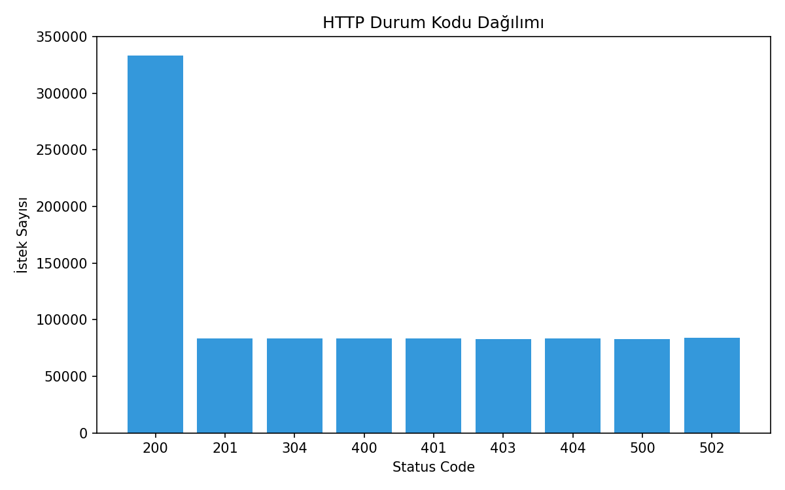
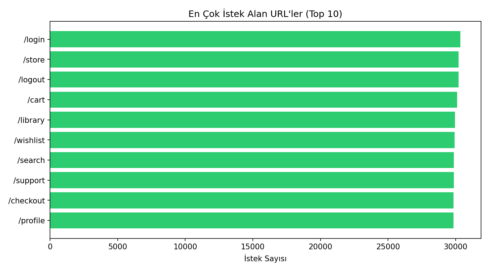
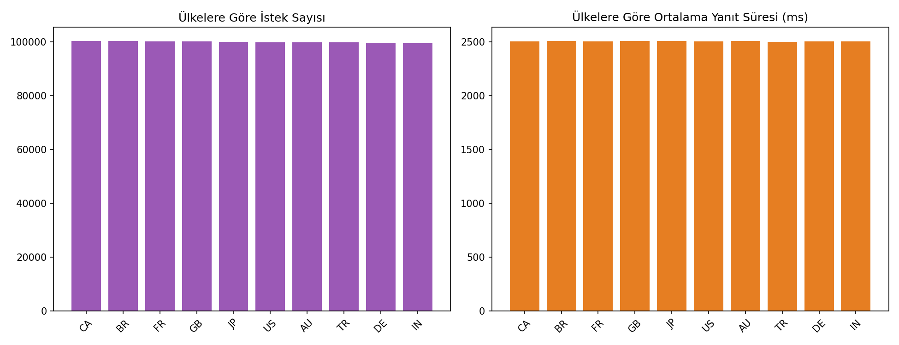
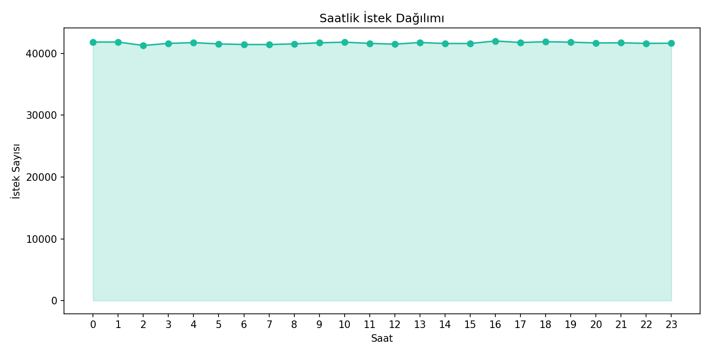
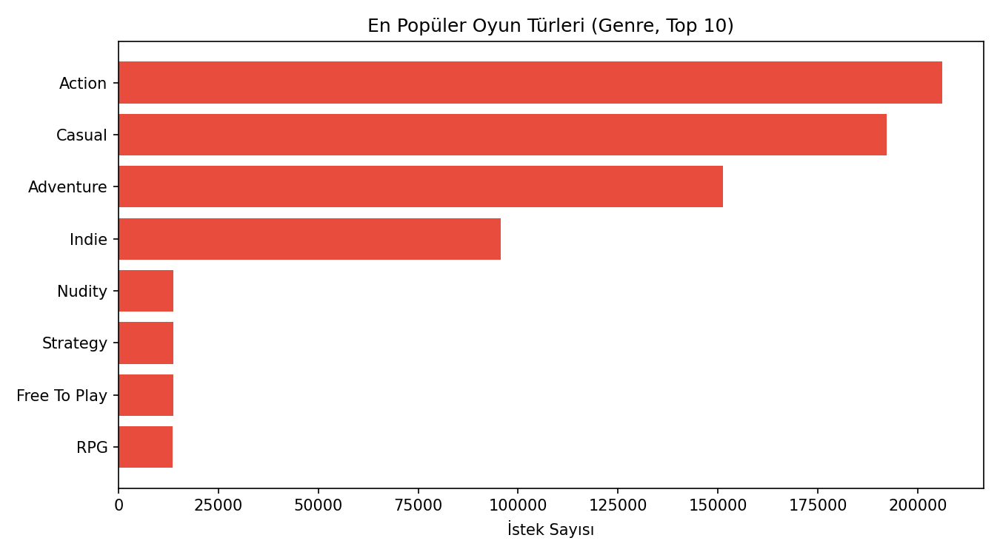

# big-data-log-analytics (Oyun Mağazası Versiyonu)

> PySpark ile bir **oyun mağazası** (Steam benzeri platform) sunucu loglarının
> büyük ölçekte üretilip analiz edildiği bir big data pipeline'ı.

---

## 🎓 Bu Proje Hakkında

Bu çalışmanın amacı, sentetik veri üretimi + PySpark ile dağıtık analiz
tekniğiyle bir **oyun mağazası platformunun** sunucu loglarını üretip
analiz etmektir.

Loglara gerçekçilik katmak için, sahte istekleri **gerçek bir Steam oyun
kataloğu** üzerinden üretiyoruz:

- **Kaggle veri seti:** [`fronkongames/steam-games-dataset`](https://www.kaggle.com/datasets/fronkongames/steam-games-dataset)
  (85.000+ Steam oyunu; AppID, isim, tür/genre, fiyat vb. kolonlar içerir).
  Paylaşılan 9 veri seti arasından bu seçildi çünkü en kapsamlı/güncel Steam
  katalog verisi bu; log üretiminde gerçekçi `appid`/oyun ismi/tür
  kombinasyonları üretmek için ideal.

---

## 📌 Proje Ne Yapıyor?

İki aşamalı bir iş akışı:

1. **`generate_logs.py`**
   - Kaggle'dan `fronkongames/steam-games-dataset` katalogunu `kagglehub` ile indirir.
   - Kataloğun `AppID`, `Name`, `Genres`, `Price` kolonlarını okuyup rastgele
     3.000 oyunluk bir örneklem çıkarır.
   - Bu oyunları kullanarak `1.000.000` satırlık sentetik "oyun mağazası"
     sunucu logu üretir, `5` ayrı CSV dosyasına böler
     (`logs/gamelogs_000.csv` → `gamelogs_004.csv`, her biri 200.000 satır).
   - Her satır: IP, timestamp, HTTP metodu, URL (ör. `/store/app/570/dota-2`),
     status kodu, yanıt süresi, user-agent, ülke, gönderilen byte, ilgili
     oyunun `appid`'si ve `genre`'ı (tür) bilgisini içerir.
   - İsteklerin %70'i belirli bir oyuna özel uç noktalara
     (`/store/app/{appid}/{slug}`, `/api/games/{appid}/reviews`,
     `/api/games/{appid}/purchase`, `/api/games/{appid}/screenshots`,
     `/library/install/{appid}`), %30'u genel mağaza sayfalarına
     (`/login`, `/search`, `/cart`, `/wishlist`, `/library`, vb.) gider.

2. **`analyze_logs.py`** — PySpark ile bu logları okuyup analiz çalıştırır
   - HTTP durum kodu dağılımı
   - En çok istek alan oyun/mağaza sayfaları (Top 10)
   - Ülkelere göre istek sayısı ve ortalama yanıt süresi
   - Saatlik istek dağılımı
   - Yavaş uç noktalar (ortalama yanıt > 2000ms)
   - HTTP hata oranları (4xx/5xx)
   - En aktif kullanıcı IP'leri (Top 10)
   - Partition sayısı ve toplam veri boyutu
   - **[Bonus]** En popüler oyun türleri (genre bazlı Top 10) — gerçek katalog
     verisi kullanmanın sağladığı ek bir analiz imkanı.

---

## 📊 Sonuçlar (gerçek çalıştırma — 1M satır, 5 dosya)

Spark, 1.000.000 satırı **5.94 saniyede** yükledi; her analiz sorgusu
1.1–5.4 saniye arasında tamamlandı (15 partition, Adaptive Query Execution
açık).

**En popüler oyun türleri (gerçek Steam kataloğundan):** Action (206.139
istek) ve Casual (192.230) en çok trafiği alıyor; Adventure (151.206) ve
Indie (95.667) onu izliyor.

**HTTP durum kodu dağılımı:** İsteklerin ~%33'ü 200 (başarılı), geri kalanı
201/304/400/401/403/404/500/502 arasında dengeli dağılıyor (rastgele
üretim gereği).

**Toplam veri hacmi:** 25.047.264.885 byte (~23.3 GB) gönderim; en aktif
IP 2.067 istek yaptı.

| | |
|---|---|
|  |  |
|  |  |



---

## 📂 Dizin Yapısı

```
big-data-log-analytics/
├── generate_logs.py
├── analyze_logs.py
├── requirements.txt
├── .gitignore
├── README.md
└── logs/                  # generate_logs.py çalıştırılınca burada oluşur (repoya dahil değil)
```

---

## 🚀 Kurulum ve Çalıştırma

### 1) Kaggle kimlik doğrulaması (bir kereye mahsus)

`kagglehub` ile veri seti indirebilmek için bir Kaggle hesabınız ve API
anahtarınız olmalı:

1. https://www.kaggle.com/settings adresine gidin → **"Create New Token"**
   butonuna tıklayın → `kaggle.json` dosyası inecek.
2. Bu dosyayı şu klasöre koyun: `C:\Users\<kullanici_adi>\.kaggle\kaggle.json`
   (alternatif olarak `KAGGLE_USERNAME` ve `KAGGLE_KEY` ortam değişkenlerini
   ayarlayabilirsiniz).

### 2) Bağımlılıkları kur ve çalıştır

```bash
pip install -r requirements.txt

# 1) Kaggle'dan oyun kataloğunu indir + log verisini üret
#    (5M satır, 10 dosya, logs/ klasörüne)
python generate_logs.py

# 2) Analizi çalıştır
python analyze_logs.py
```

> Not: `logs/` klasörü `.gitignore` ile hariç tutulur — 5M satırlık veri
> repoya dahil edilmez. Projeyi klonlayan herkes `generate_logs.py`'yi
> çalıştırarak kendi veri setini üretir (ilk çalıştırmada Kaggle katalog
> verisi indirilir, sonraki çalıştırmalarda `kagglehub` önbellekten okur).

---

## ⚙️ Teknik Detaylar

- Spark **Adaptive Query Execution** (`spark.sql.adaptive.enabled`) açık —
  sorgu planı çalışma zamanında optimize edilir.
- `analyze_logs.py` her adımın süresini ölçüp raporlar (`time.time()` ile).
- Veri `logs/*.csv` üzerinden tek seferde okunur; 10 dosya tek bir
  DataFrame'e birleşir.
- `generate_logs.py`, gerçek veri setinden gelen oyun bilgilerini (appid,
  isim → slug, tür) URL üretiminde kullanarak logları daha gerçekçi hale
  getirir (dış veri setiyle çalışma, kolon normalizasyonu, örneklem alma,
  slug üretimi).

---

## 🛠️ Kullanılan Teknolojiler

`Python` · `PySpark` · `Apache Spark SQL` · `kagglehub` · `pandas`

---

<p align="center"><i>Big data / PySpark pratiği amaçlı, öğrenme sürecinde egzersiz olarak hazırlanmış bir versiyondur.</i></p>
