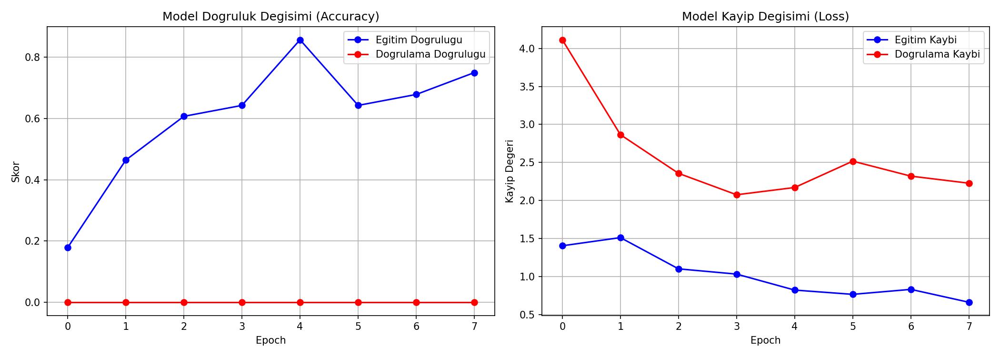
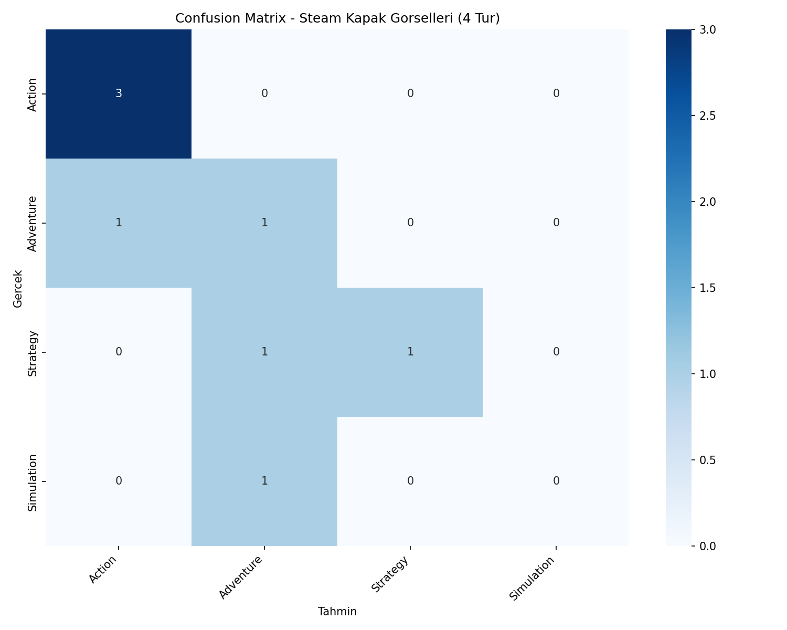
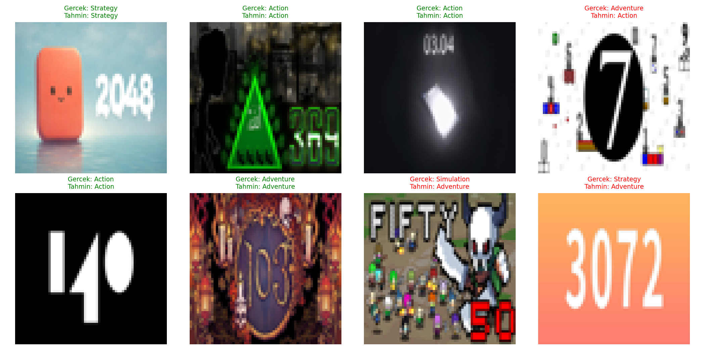

# Steam Kapak Görseli CNN Tür Sınıflandırma (Fashion-MNIST CNN — Oyun Versiyonu)

## 🎓 Bu Proje Hakkında

Bu çalışmanın amacı, bir CNN mimarisini uçtan uca kurmaktır (veri yükleme
→ normalize → CNN → eğitim → confusion matrix → örnek tahminler).
**Steam mağazasındaki oyunların kapak görselleri**, oyunun ana türüne
göre sınıflandırılıyor.

## 🎯 Projenin Amacı

Steam mağazasından çekilen gerçek oyun kapak (`header_image`) görsellerini,
8 ana tür kategorisinden (Action, Adventure, RPG, Strategy, Simulation,
Sports, Racing, Puzzle) birine sınıflandırmak.

## 📊 Veri Seti

**Kaggle:** [`fronkongames/steam-games-dataset`](https://www.kaggle.com/datasets/fronkongames/steam-games-dataset)
— 85.000+ Steam oyunu; `AppID`, `Name`, `Genres`, `header_image` (mağaza
kapak görseli URL'si) kolonlarını içerir.

**Neden bu veri seti seçildi?** Bu proje bir *görüntü* sınıflandırma
egzersizi olduğu için, paylaşılan 9 veri seti arasından gerçek oyun
görseline (URL) sahip tek veri seti bu — diğerleri (video game sales,
ratings vb.) tamamen tablo verisi, görsel içermiyor.

**Veri nereden geliyor, ekstra dosya eklemem gerekiyor mu?**
Script, Steam kataloğunu `kagglehub` ile otomatik indirir, ardından her
tür için `header_image` URL'lerinden kapak görsellerini indirip
`data/images/` klasörüne önbelleğe alır (aynı `AppID` tekrar
indirilmez). Kaggle kimlik doğrulaması (`kaggle.json`) ve internet
bağlantısı gereklidir — bkz. "Kurulum" bölümü.

## 🧠 Model Mimarisi

```
Conv2D(32, 3x3, relu) → MaxPooling2D(2x2)
Conv2D(64, 3x3, relu) → MaxPooling2D(2x2)
Flatten → Dense(128, relu) → Dropout(0.3) → Dense(8, softmax)
```

Görsel boyutu: 64×64×3 (RGB) · Optimizer: Adam · Loss: Sparse Categorical
Crossentropy · 8 epoch · batch size 32

## 🚀 Kurulum ve Çalıştırma

### 1) Kaggle kimlik doğrulaması (bir kereye mahsus)

1. https://www.kaggle.com/settings → **"Create New Token"** → `kaggle.json` indir.
2. `C:\Users\<kullanici_adi>\.kaggle\kaggle.json` konumuna koy.

### 2) Çalıştır

```bash
pip install -r requirements.txt
python fashion_mnist_cnn.py
```

İlk çalıştırmada Steam katalog CSV'si ve ~1600 kapak görseli (8 tür × 200
görsel) indirilir; sonraki çalıştırmalarda `data/images/` önbelleğinden
okunur.

## 📊 Sonuçlar (gerçek çalıştırma)

**Önemli bulgu:** Bu Kaggle veri seti anlık görüntüsündeki `header_image`
URL'lerinin büyük bir kısmı artık ölü/erişilemez (kaldırılmış/gizlenmiş
oyunlar) — 8 tür × 200 hedeflenen görselden yalnızca **40 tanesi**
gerçekten indirilebildi, ve `RPG`/`Sports`/`Racing`/`Puzzle` türlerinde
yeterli örnek toplanamadığı için bu 4 tür otomatik olarak elendi (script
artık bunu tespit edip güvenli şekilde atlıyor).

**4 sınıf (Action, Adventure, Simulation, Strategy) üzerinde 40 gerçek
görselle:**

| Metrik | Değer |
|---|---|
| Test Doğruluğu | **%62.50** (rastgele tahmin: %25) |
| Test Kaybı | 1.2673 |

Küçük örneklem nedeniyle sonuç istatistiksel olarak güçlü değil, ama
rastgele tahminin belirgin şekilde üzerinde — model gerçek görsellerden
tür ayırt edici özellikler öğrenebiliyor. Daha güvenilir bir sonuç için
`IMAGES_PER_GENRE` sabitini büyütüp daha fazla oyun/tür denenebilir.

| | |
|---|---|
|  |  |



## 🛠️ Kullanılan Teknolojiler

`Python` · `TensorFlow/Keras` · `scikit-learn` · `pandas` · `Pillow` ·
`requests` · `kagglehub` · `matplotlib` · `seaborn`

<p align="center"><i>Bilgisayarlı görü ve CNN pratiği amaçlı, öğrenme sürecinde egzersiz olarak hazırlanmış bir versiyondur.</i></p>
