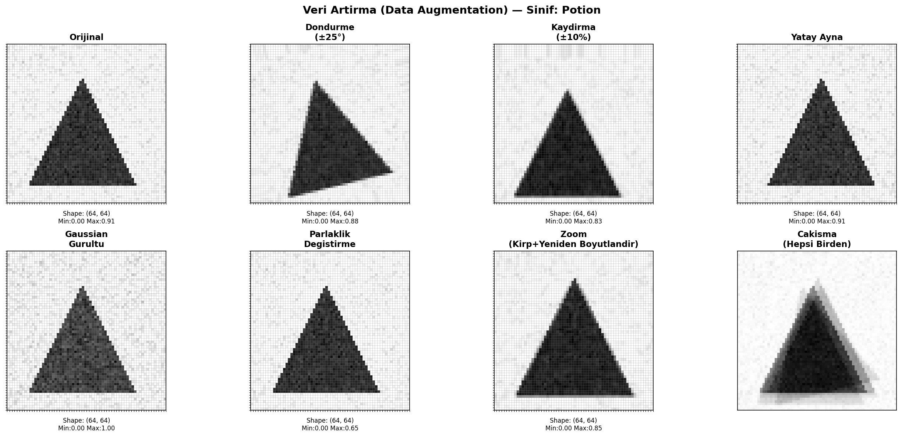
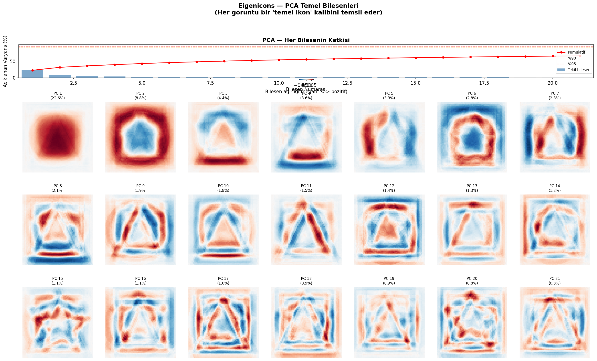
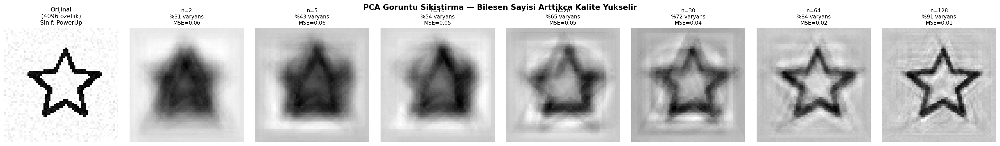
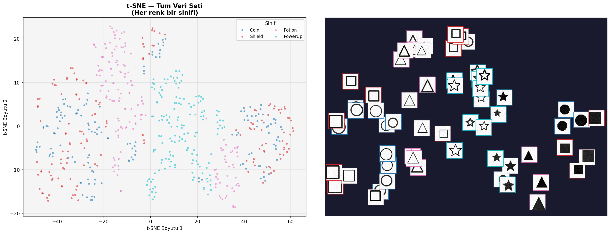

# Görüntü Ön İşleme — Oyun İkonları Versiyonu (Augmentation, PCA, t-SNE)

## 🎓 Bu Proje Hakkında

Bu çalışmanın amacı, augmentation → MLP karşılaştırması → PCA (eigenicons
+ sıkıştırma) → t-SNE işlem hattını kurmaktır.

Paylaşılan 9 Kaggle veri setinden hiçbiri ham piksel görüntüsü içermediği
için, gerekli özellik mühendisliği adımlarını göstermek amacıyla
**sentetik** şekiller (Daire/Kare/Üçgen/Yıldız) oyun ikonlarına çevrilerek
üretiliyor: **Coin** (Para), **Shield** (Kalkan), **Potion** (İksir),
**PowerUp** (Güçlendirme).

## 📊 Veri Seti Hakkında Not

Paylaşılan 9 Kaggle veri setinden hiçbiri ham piksel/görüntü içermiyor
(hepsi tablo verisi — oyun satışları, fiyatlar, puanlar). Bu proje bir
**görüntü ön işleme teknikleri** çalışması olduğu için, görev tanımındaki
*"uygun veri seti yoksa başka uygun bir yöntem kullanılabilir"* istisnası
burada uygulanmıştır: gerçek bir Kaggle veri seti yerine, oyun ikonu temalı
sentetik görüntüler üretilmiştir. Gerçek görsellerle çalışan CNN pratiği
için bkz. [`01-fashion-mnist-cnn`](../01-fashion-mnist-cnn) (Steam kapak
görselleri kullanır).

## 📌 Proje Ne Yapıyor?

1. **Sentetik ikon üretimi** — 4 sınıf (Coin, Shield, Potion, PowerUp), her
   biri gürültü ve rastgele konum/boyut varyasyonuyla çizilmiş 64×64 gri
   tonlamalı görüntüler (`n_per_class=150`).
2. **Veri Artırma (Augmentation)** — döndürme, kaydırma, yatay ayna,
   Gaussian gürültü, parlaklık değişimi, zoom. Orijinal vs. augmented veriyle
   eğitilen iki `MLPClassifier`'ın test doğruluğu karşılaştırılır.
3. **PCA** — "eigenicons" (temel bileşen görselleştirmesi), %90/%95/%99
   varyans için gereken bileşen sayısı, bileşen sayısına göre sıkıştırma
   kalitesi karşılaştırması.
4. **t-SNE** — yüksek boyutlu ikon verisinin 2 boyuta indirgenip
   görselleştirilmesi (önce PCA ile ön-indirgeme, sonra t-SNE).

## 🚀 Çalıştırma

```bash
pip install -r requirements.txt
python cnn-goruntu-on-isleme.py
```

Herhangi bir indirme/kimlik doğrulama gerektirmez — tüm veri script içinde
sentetik olarak üretilir.

## 📊 Sonuçlar (gerçek çalıştırma)

**Augmentation etkisi (MLPClassifier, test doğruluğu):**

| Eğitim Verisi | Test Doğruluğu |
|---|---|
| Orijinal (450 örnek) | **98.00%** |
| Augmented (900 örnek) | 95.33% |

Bu küçük/temiz sentetik veri setinde augmentation doğruluğu **-2.67 puan**
düşürdü. Bu beklenmedik gibi görünse de mantıklı bir sonuç: sınıflar zaten
görsel olarak çok ayrışık (basit geometrik şekiller) ve veri seti gürültüsüz
olduğundan, augmentation'ın getirdiği ekstra varyasyon MLP için gereksiz
zorluk yaratıyor — augmentation gerçek/karmaşık verilerde (ör.
[`01-fashion-mnist-cnn`](../01-fashion-mnist-cnn)) daha çok fayda sağlar.

**PCA sıkıştırma:** 4096 pikselden %90 varyans için sadece **110 bileşen**
yeterli (37.2x sıkıştırma), %95 için 197, %99 için 403 bileşen gerekiyor.

**Görseller (`figures/`):**

| | |
|---|---|
|  |  |
|  |  |

## 🛠️ Kullanılan Teknolojiler

`Python` · `OpenCV` · `scikit-learn` (PCA, t-SNE, MLPClassifier) · `matplotlib`

<p align="center"><i>Görüntü ön işleme pratiği amaçlı, öğrenme sürecinde egzersiz olarak hazırlanmış bir versiyondur.</i></p>
