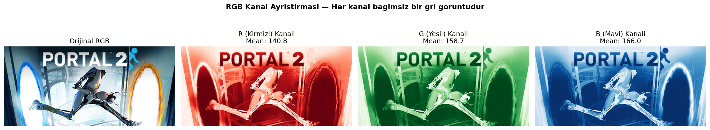
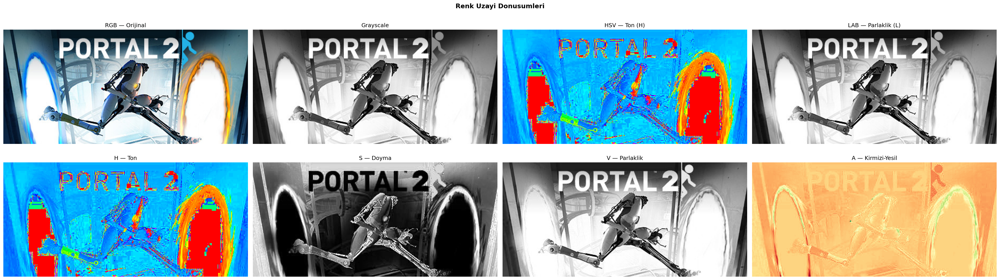
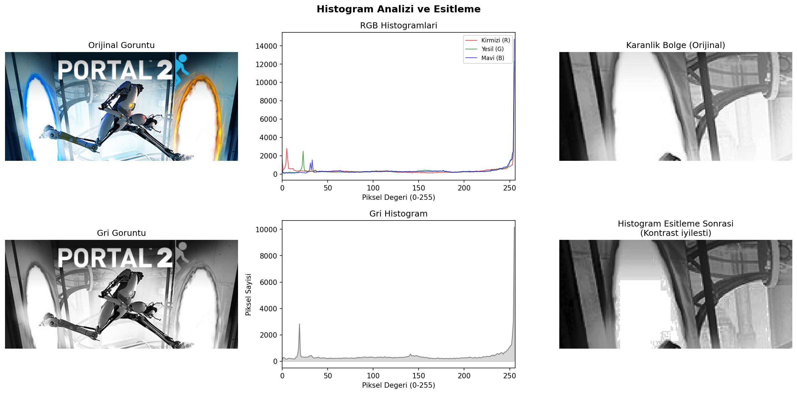
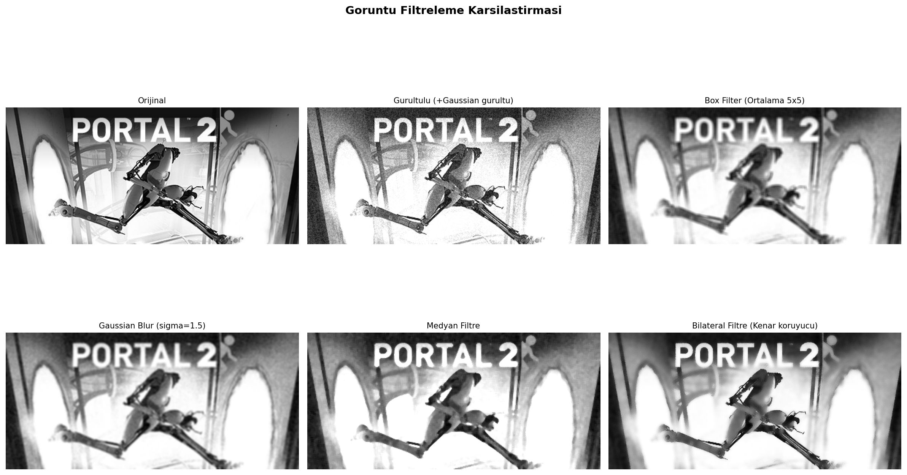
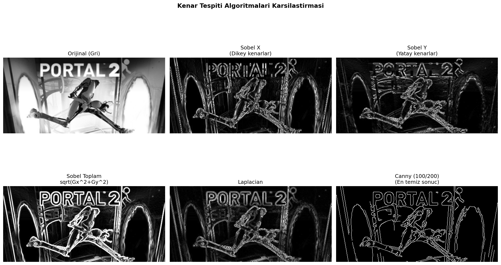
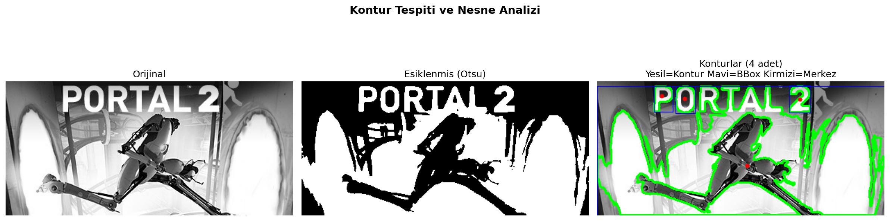

# OpenCV Görüntü İşleme — Steam Kapak Görseli Versiyonu

## 🎓 Bu Proje Hakkında

Bu çalışmanın amacı, 10 bölümlük klasik bir OpenCV işlem hattını (RGB
kanalları → kırpma/döndürme/ölçekleme → renk uzayları → histogram →
filtreleme → kenar tespiti → morfolojik işlemler → eşikleme → kontur
tespiti) uçtan uca uygulamaktır. Telif sorunu yaşamamak için, Kaggle'dan
indirilen gerçek bir **Steam oyununun mağaza kapak (header) görseli**
kullanılıyor.

## 📊 Veri Seti

**Kaggle:** [`fronkongames/steam-games-dataset`](https://www.kaggle.com/datasets/fronkongames/steam-games-dataset)
— script varsayılan olarak **Portal 2**'nin `header_image` görselini
indirir (`TARGET_GAME_NAME` değişkenini değiştirerek başka bir oyun
denenebilir; katalogda isim eşleşmesi bulunamazsa Steam CDN'inin standart
`header.jpg` kalıbına düşer).

**Neden bu veri seti seçildi?** Bu, 01 numaralı projeyle aynı gerekçe:
paylaşılan 9 veri seti arasında gerçek görsel URL'sine sahip tek veri seti
bu olduğu için.

## 📌 Proje Ne Yapıyor?

10 bölümlük bir OpenCV işlem hattı uygulanıyor. Sabit piksel koordinatları
yerine (Steam kapak görselleri ~460×215 piksel civarında olduğundan)
görüntü boyutuna **oranlı** koordinatlar kullanılıyor, böylece farklı bir
oyun/görsel boyutuyla da script kırılmadan çalışır.

1. Görüntü yükleme ve gösterme
2. RGB kanal ayrıştırması + piksel inceleme
3. Logo/başlık bölgesi kırpma
4. Temel manipülasyon (kırpma, resize, döndürme, ayna)
5. Renk uzayları (RGB, Grayscale, HSV, LAB) + HSV renk maskeleme
6. Histogram analizi ve eşitleme
7. Filtreleme (Box, Gaussian, Medyan, Sharpening, Bilateral) + PSNR karşılaştırması
8. Kenar tespiti (Sobel, Laplacian, Canny)
9. Morfolojik işlemler (Erosion, Dilation, Opening, Closing, Gradient)
10. Eşikleme (Global, Otsu, Adaptif) + kontur tespiti / bounding box / merkez

## 🚀 Kurulum ve Çalıştırma

### 1) Kaggle kimlik doğrulaması (bir kereye mahsus)

1. https://www.kaggle.com/settings → **"Create New Token"** → `kaggle.json` indir.
2. `C:\Users\<kullanici_adi>\.kaggle\kaggle.json` konumuna koy.

### 2) Çalıştır

```bash
pip install -r requirements.txt
python cnn-opencv.py
```

## 📊 Sonuçlar (gerçek çalıştırma — Portal 2 kapak görseli)

**Filtreleme kalitesi (PSNR, orijinal görsele yakınlık):**

| Filtre | PSNR (dB) |
|---|---|
| Box Filter | 17.63 |
| Gaussian Blur | 18.15 |
| Medyan Filtre | 18.14 |
| Bilateral Filtre | **19.19** (en iyi) |

Bilateral filtre, kenarları korurken gürültüyü azalttığı için en yüksek
PSNR değerini verdi — beklenen sonuç.

**Diğer bulgular:** Otsu eşikleme eşiği = 154 · toplam 32 kontur tespit
edildi, bunlardan 4 tanesi 200px²'den büyük (anlamlı şekiller).

**Görseller (`figures/`):**

| | | |
|---|---|---|
|  |  |  |
|  |  |  |

14 görselin tamamı (`01_yuklenen_goruntu.png` → `14_kontur_tespiti.png`)
`figures/` klasöründe.

## 🛠️ Kullanılan Teknolojiler

`Python` · `OpenCV` · `Pillow` · `pandas` · `requests` · `kagglehub` · `matplotlib`

<p align="center"><i>Görüntü işleme pratiği amaçlı, öğrenme sürecinde egzersiz olarak hazırlanmış bir versiyondur.</i></p>
