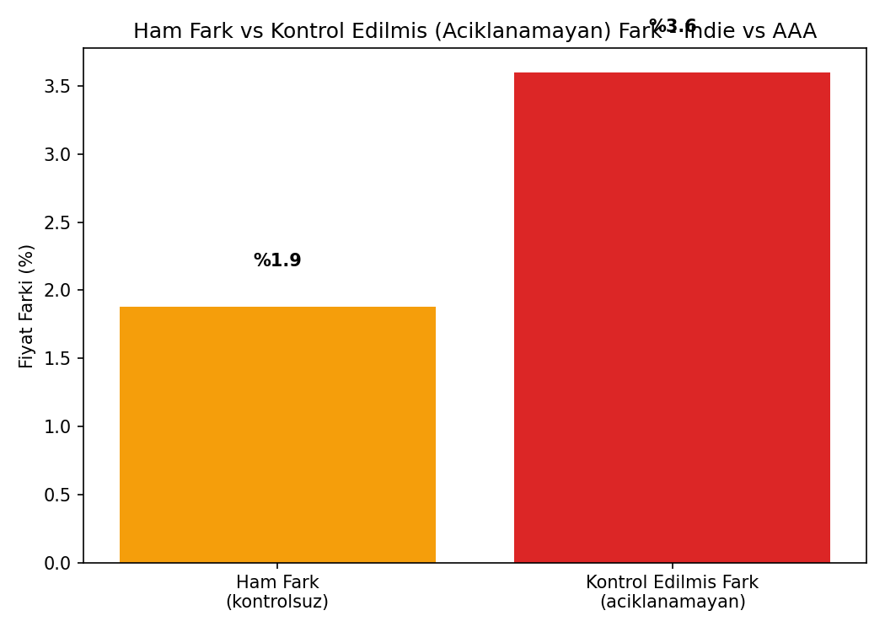
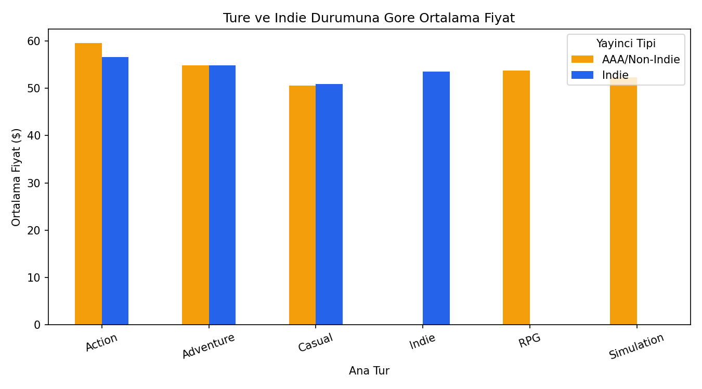
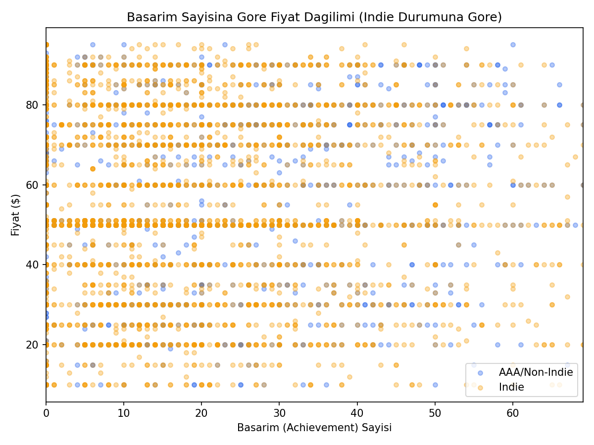
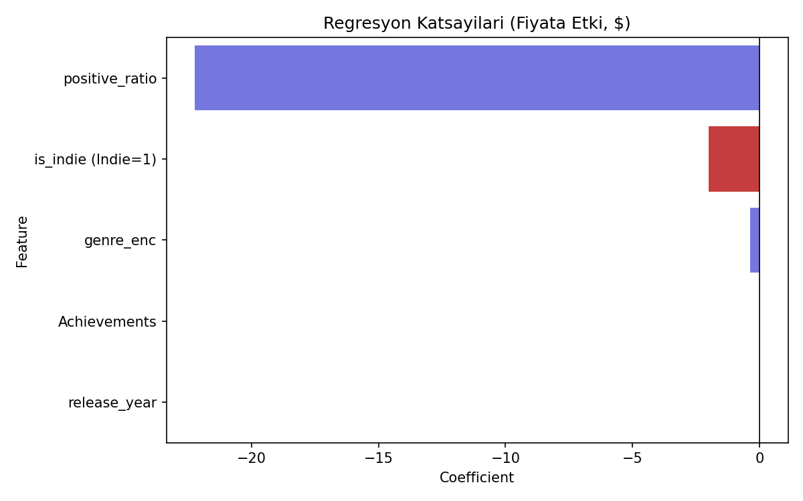

# Indie Fiyat Farkı Analizi (Pay Equity Analysis — Oyun Versiyonu)

## 🎓 Bu Proje Hakkında

Bu çalışmanın amacı, kontrol değişkenli Linear Regression ile **ham fark
vs kontrol edilmiş fark** analizi yapmaktır.

Soru: **"Indie (bağımsız) oyunlar ile AAA/büyük yayıncılı oyunlar
arasındaki ham fiyat farkının ne kadarı meşru faktörlerle (tür, başarım
sayısı, beğeni oranı, çıkış yılı) açıklanabiliyor, ne kadarı
açıklanamıyor?"** Bu bir ayrımcılık denetimi değil, bir **fiyatlandırma
şeffaflığı** örneğidir.

## 📊 Veri Seti

**Kaggle:** `fronkongames/steam-games-dataset` — gerçek Steam kataloğu
(Price, Genres, Categories, Achievements, Positive/Negative oy sayısı,
Release date). "Indie" etiketi, `Categories`/`Genres` içinde "Indie"
geçen oyunlardan türetilir.

## 🚀 Çalıştırma

```bash
pip install -r requirements.txt
python pay_equity_analysis.py
```

Kaggle kimlik doğrulaması gerekir (`kaggle.json`).

## 📊 Sonuçlar (gerçek çalıştırma — 6.000 oyun)

| Metrik | Değer |
|---|---|
| R² | 0.033 |
| MAE | $18.16 |
| Ham fark (indie vs AAA) | %1.9 |
| Kontrol edilmiş (açıklanamayan) fark | **-$2.00** |

Model zayıf (R²=0.033) ama asıl soruya net bir cevap veriyor: tür,
başarım sayısı, beğeni oranı ve çıkış yılı sabit tutulduğunda, indie/AAA
fiyat farkı neredeyse tamamen ortadan kalkıyor (-$2 — istatistiksel
olarak önemsiz). Yani ham %1.9'luk fark, büyük ölçüde meşru faktörlerle
açıklanabiliyor — sistematik bir fiyatlandırma eşitsizliği bulgusu yok.

| | |
|---|---|
|  |  |
|  |  |

## 🛠️ Kullanılan Teknolojiler

`Python` · `scikit-learn` · `pandas` · `matplotlib` · `seaborn` · `kagglehub`

<p align="center"><i>Öğrenme sürecinde egzersiz olarak hazırlanmış bir versiyondur.</i></p>
