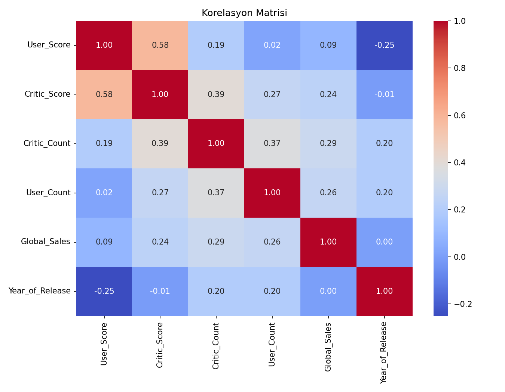
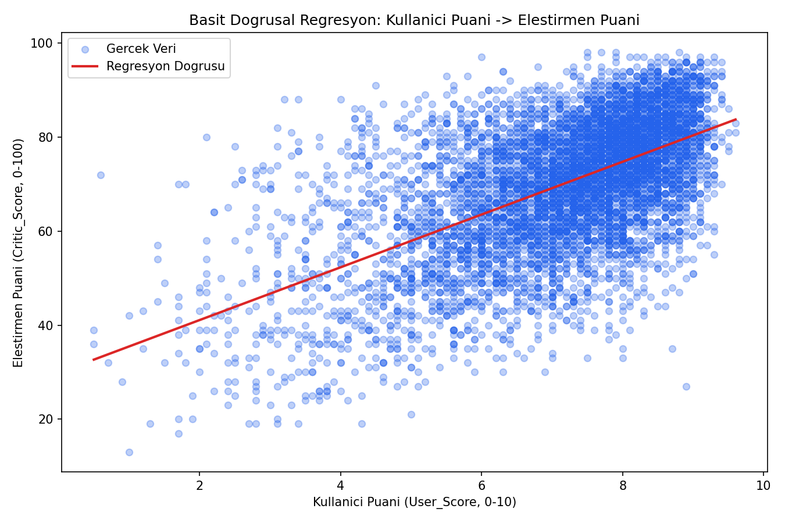
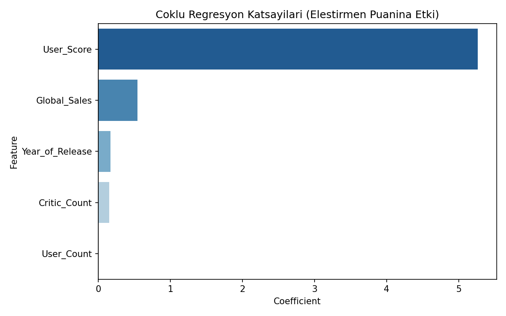
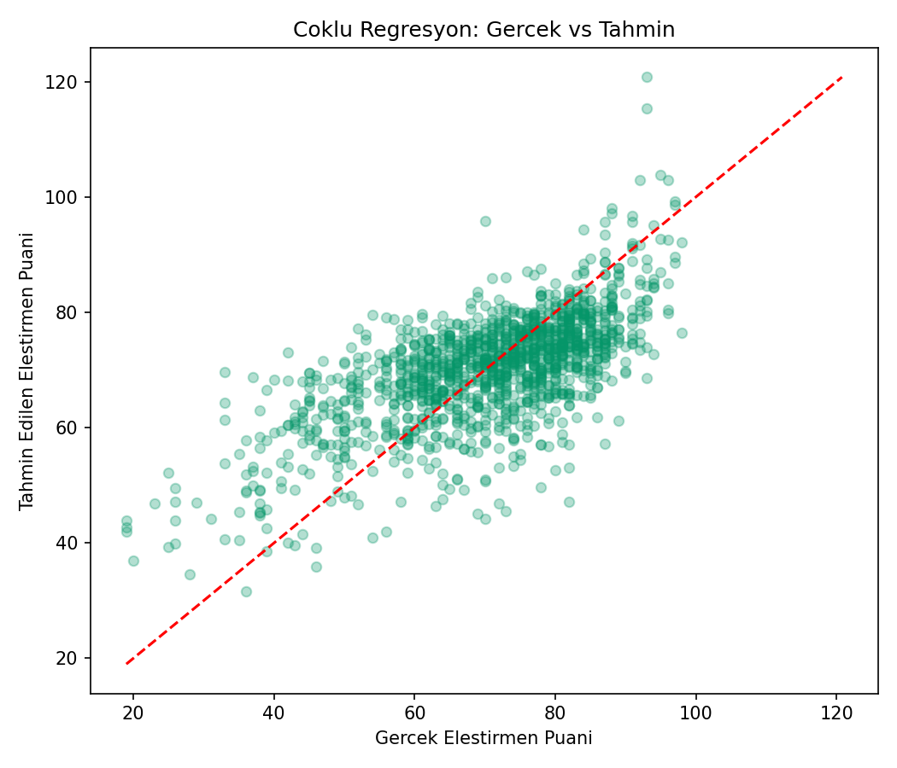

# Oyun Eleştirmen Puanı Tahmini (Süper Lig Gol Tahmini — Oyun Versiyonu)

## 🎓 Bu Proje Hakkında

Bu çalışmanın amacı, basit ve çoklu doğrusal regresyonu aynı problem
üzerinde karşılaştırmaktır: "kullanıcı puanı → eleştirmen puanı" (basit)
ve "tüm oyun istatistikleri → eleştirmen puanı" (çoklu) olarak uygulanır.

## 📊 Veri Seti

**Kaggle:** `rush4ratio/video-game-sales-with-ratings` — gerçek
`Critic_Score`/`User_Score` ve satış/platform/tür bilgisi içerir.

## 🚀 Çalıştırma

```bash
pip install -r requirements.txt
python superlig_goal_regression.py
```

## 📊 Sonuçlar (gerçek çalıştırma — 6.894 kayıt)

| Model | R² | RMSE | MAE |
|---|---|---|---|
| Basit regresyon (User_Score → Critic_Score) | 0.339 | 11.22 | 8.93 |
| Çoklu regresyon (tüm özellikler) | **0.452** | 10.22 | 8.10 |

Çoklu regresyon, basit regresyona göre R²'yi %11 puan iyileştiriyor —
`Global_Sales`, `Year_of_Release` ve `Critic_Count` gibi ek özellikler
gerçekten açıklayıcı katkı sağlıyor (`User_Score` katsayısı 5.26 ile en
baskın etken olmaya devam ediyor).

| | |
|---|---|
|  |  |
|  |  |

## 🛠️ Kullanılan Teknolojiler

`Python` · `scikit-learn` · `pandas` · `matplotlib` · `seaborn` · `kagglehub`

<p align="center"><i>Öğrenme sürecinde egzersiz olarak hazırlanmış bir versiyondur.</i></p>
