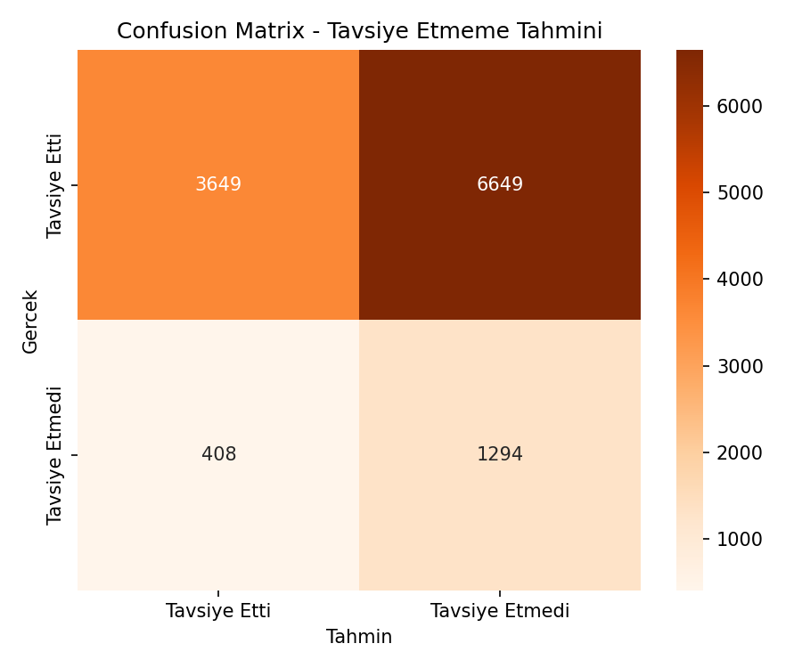
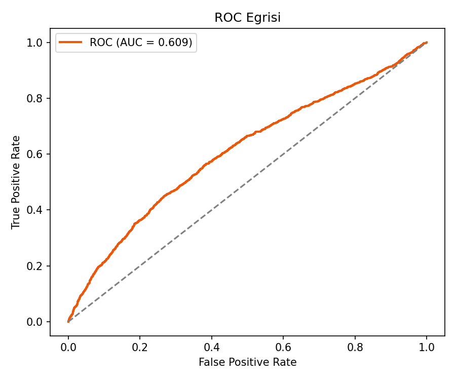
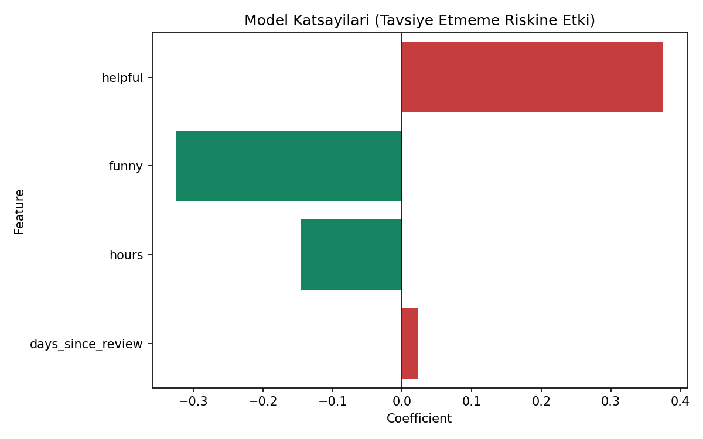
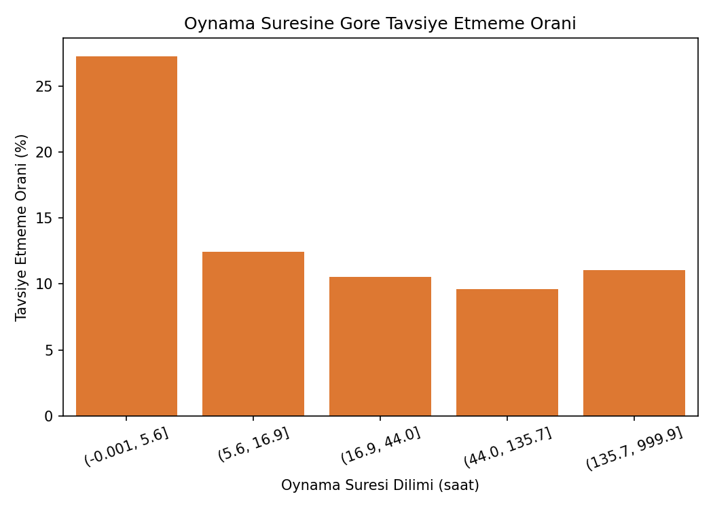

# Oyun Tavsiye Etmeme (Churn Analoğu) Tahmini — Oyun Versiyonu

## 🎓 Bu Proje Hakkında

Bu çalışmanın amacı, standardizasyon + ROC-AUC + katsayı yorumlama içeren
bir Logistic Regression churn (kayıp) tahmini kurmaktır.

Hedef gerçek bir Steam sinyaline dayanır: **`is_recommended`** — bir
oyuncunun oynadığı oyunu **tavsiye etmemesi** bir memnuniyetsizlik/churn
sinyali olarak ele alınıyor. Sentetik formülle üretilmiş bir etiket değil,
**gerçek bir hedef kolon** kullanılıyor.

## 📊 Veri Seti

**Kaggle:** `antonkozyriev/game-recommendations-on-steam` (`recommendations.csv`)
— her satır bir kullanıcının bir oyun için bıraktığı gerçek değerlendirme
(oynama süresi, faydalı/komik oy sayısı, tarih, tavsiye durumu).

**Neden bu veri seti seçildi?** Bu bir sınıflandırma görevi ve zaten
hazır bir "tavsiye edildi mi" hedef kolonuna sahip tek veri seti bu
olduğundan — formülle etiket türetmeye gerek kalmadı.

## 🚀 Çalıştırma

```bash
pip install -r requirements.txt
python churn_prediction.py
```

## 📊 Sonuçlar (gerçek çalıştırma — 60.000 değerlendirme, %14.2 churn oranı)

| Model | Accuracy | ROC-AUC | Azınlık sınıf recall |
|---|---|---|---|
| Ağırlıksız Logistic Regression | %85.8 | 0.596 | 0.00 |
| `class_weight="balanced"` | %41.2 | **0.609** | **0.76** |

Aynı sınıf-dengesizliği tuzağı burada da vardı: ağırlıksız model çoğunluk
sınıfını ("Tavsiye Etti") ezici doğrulukla tahmin edip churn'ü hiç
yakalayamıyordu. `class_weight="balanced"` ile churn recall'u 0'dan
0.76'ya çıktı ve ROC-AUC de arttı (0.596 → 0.609) — model artık gerçekten
işe yarar bir churn sinyali taşıyor.

| | |
|---|---|
|  |  |
|  |  |

## 🛠️ Kullanılan Teknolojiler

`Python` · `scikit-learn` · `pandas` · `matplotlib` · `seaborn` · `kagglehub`

<p align="center"><i>Öğrenme sürecinde egzersiz olarak hazırlanmış bir versiyondur.</i></p>
