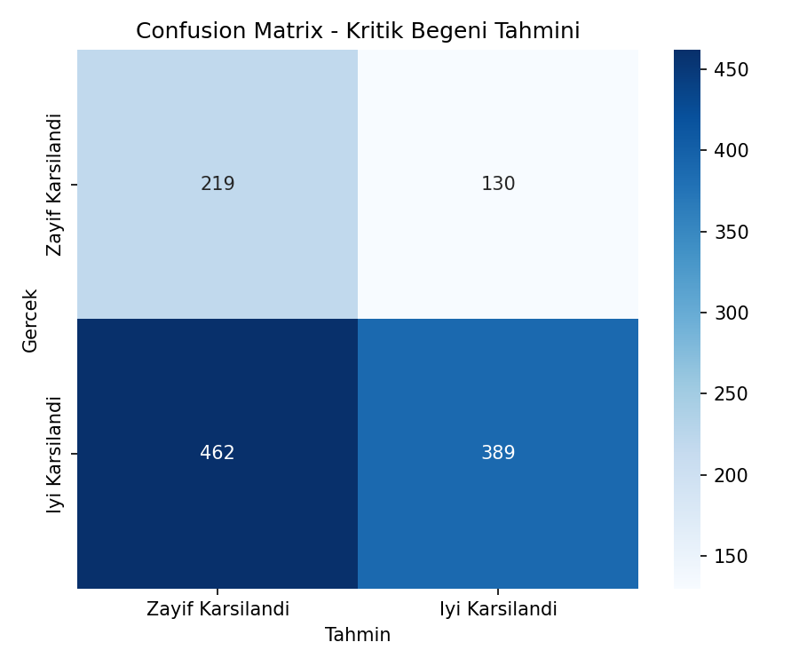
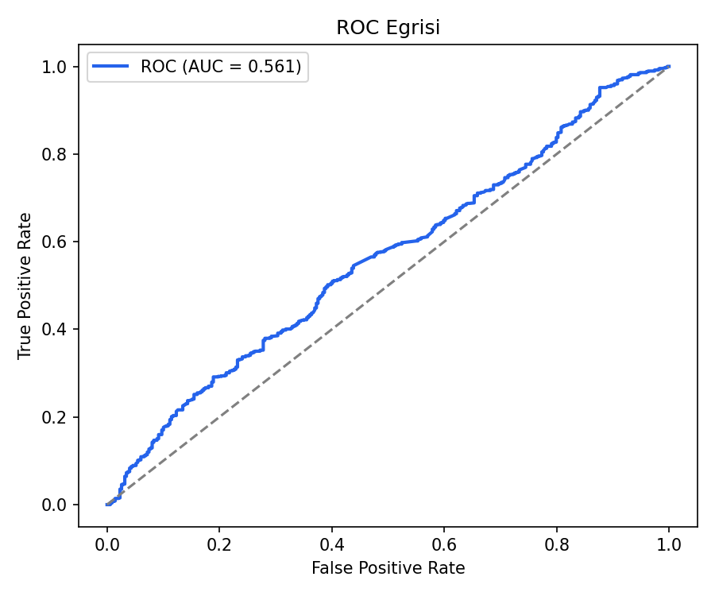
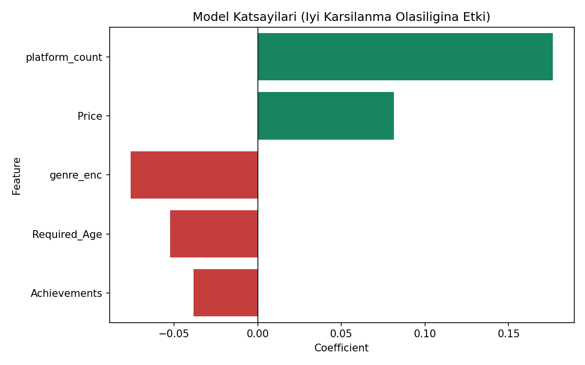

# Oyun Kritik Beğeni Tahmini (Credit Scoring Analoğu) — Oyun Versiyonu

## 🎓 Bu Proje Hakkında

Bu çalışmanın amacı, "kara kutu olmayan" açıklanabilir bir Logistic
Regression modeli kurmaktır.

Hedef: **"oyun kritik açıdan iyi karşılanacak mı"** (olumlu yorum oranı >
%70) ikili kararı — özelliklerden bir kararı açıklanabilir şekilde tahmin
etme mantığı izlenir.

## 📊 Veri Seti

**Kaggle:** `fronkongames/steam-games-dataset` — Price, Genres, Achievements,
Required Age, Windows/Mac/Linux desteği, Positive/Negative oy sayısı.

## 🚀 Çalıştırma

```bash
pip install -r requirements.txt
python credit_scoring.py
```

## 📊 Sonuçlar (gerçek çalıştırma — 6.000 oyun, %70.9 "iyi karşılandı")

| Model | Accuracy | ROC-AUC | Azınlık sınıf recall |
|---|---|---|---|
| Ağırlıksız Logistic Regression | %70.9 | 0.560 | 0.01 |
| `class_weight="balanced"` | %50.7 | 0.561 | **0.63** |

**Önemli bulgu:** Ağırlıksız model, sınıf dengesizliğinden (%71 vs %29)
faydalanıp neredeyse her zaman "İyi Karşılandı" tahmin ederek yüksek
accuracy elde ediyordu, ama azınlık sınıfını (kritik açıdan zayıf
karşılanan oyunlar) neredeyse hiç yakalayamıyordu (recall=0.01) — accuracy
tek başına yanıltıcı bir metrik. `class_weight="balanced"` eklenerek
azınlık sınıf recall'u 0.01'den 0.63'e çıkarıldı; genel accuracy düştü
ama model artık gerçekten faydalı bir sınıflandırıcı (ROC-AUC neredeyse
sabit kaldı çünkü eşikten bağımsız bir metrik).

| | |
|---|---|
|  |  |



## 🛠️ Kullanılan Teknolojiler

`Python` · `scikit-learn` · `pandas` · `matplotlib` · `seaborn` · `kagglehub`

<p align="center"><i>Öğrenme sürecinde egzersiz olarak hazırlanmış bir versiyondur.</i></p>
