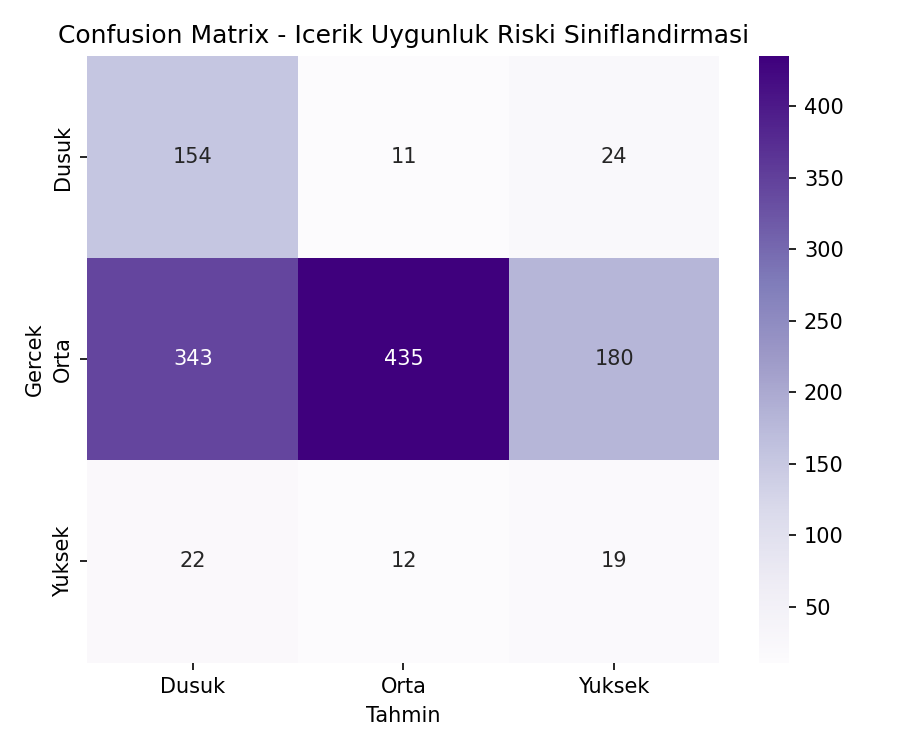
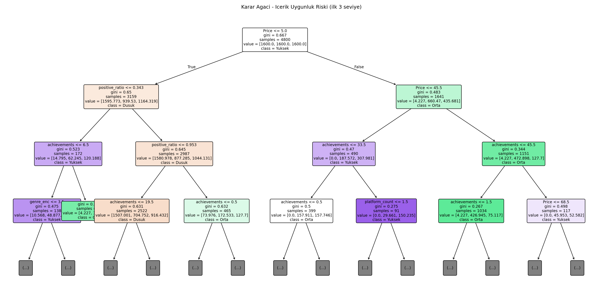
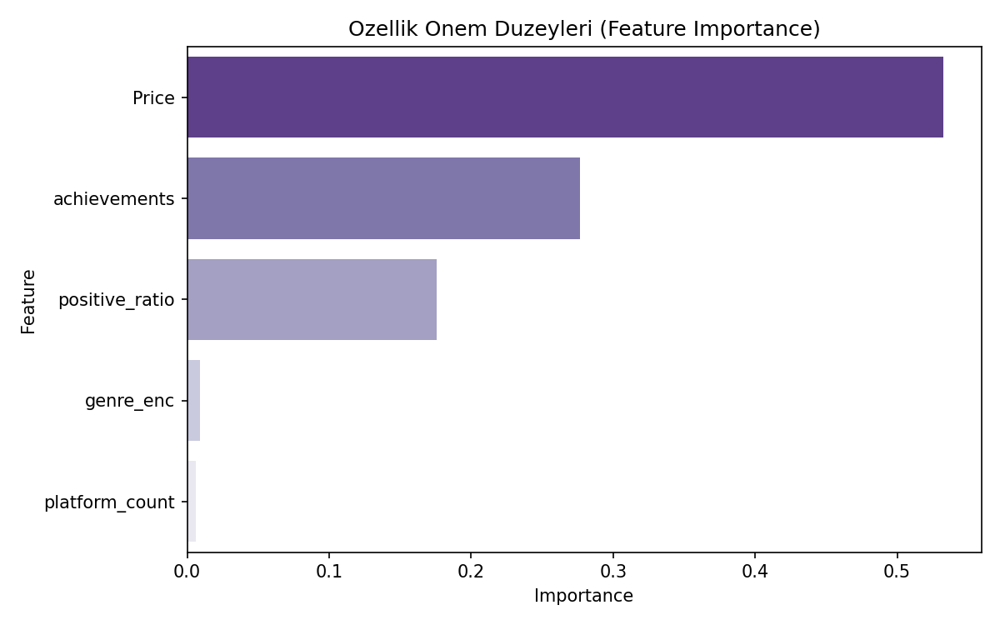

# Oyun İçerik Uygunluk Riski Sınıflandırması (Klinik Karar Ağacı — Oyun Versiyonu)

## 🎓 Bu Proje Hakkında

Bu çalışmanın amacı, Düşük/Orta/Yüksek riskini sınıflandıran, açıklanabilir
kurallar üreten bir Decision Tree kurmaktır.

Hedef değişken (`risk_level`), veri setindeki gerçek **`Required Age`**
(yaş sınırı) kolonundan türetilir (0 → Düşük, 1-15 → Orta, 16+ → Yüksek);
bu kolon sızıntı olmasın diye özelliklerden çıkarılır — model sadece
tür/fiyat/beğeni/platform gibi dolaylı özelliklerden tahmin yapar.

## 📊 Veri Seti

**Kaggle:** `fronkongames/steam-games-dataset` — gerçek `Required Age`
kolonu + tür/fiyat/beğeni gibi dolaylı özellikler.

## 🚀 Çalıştırma

```bash
pip install -r requirements.txt
python decision_tree_clinical.py
```

## 📊 Sonuçlar (gerçek çalıştırma — 6.000 oyun; risk dağılımı Orta %80 / Düşük %16 / Yüksek %4)

| Model | Accuracy | Düşük recall | Orta recall | Yüksek recall |
|---|---|---|---|---|
| Ağırlıksız Decision Tree | %79.8 | 0.00 | **1.00** | 0.00 |
| `class_weight="balanced"` | %50.7 | **0.81** | 0.45 | **0.36** |

Ağırlıksız ağaç, en kalabalık sınıfı (Orta, %80) her seferinde tahmin
ederek yüksek görünen bir accuracy elde ediyordu ama azınlık sınıfları
(Düşük, Yüksek) hiç tanıyamıyordu. `class_weight="balanced"` ile genel
accuracy düşse de, üç sınıfın da gerçekten öğrenilmesi sağlandı — özellikle
bu tür bir içerik-riski sınıflandırmasında "yüksek riskli içeriği kaçırmamak"
accuracy'den daha kritik bir hedeftir.

| | |
|---|---|
|  |  |



## 🛠️ Kullanılan Teknolojiler

`Python` · `scikit-learn` · `pandas` · `matplotlib` · `seaborn` · `kagglehub`

<p align="center"><i>Öğrenme sürecinde egzersiz olarak hazırlanmış bir versiyondur.</i></p>
