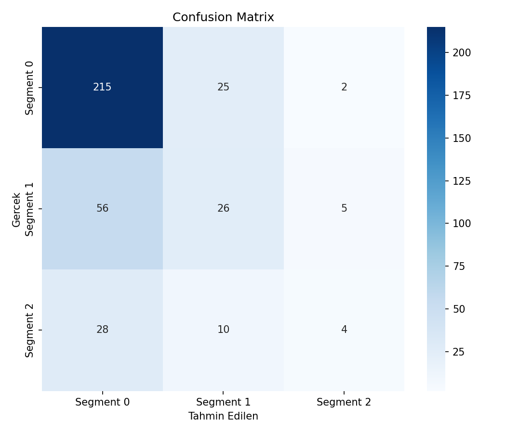
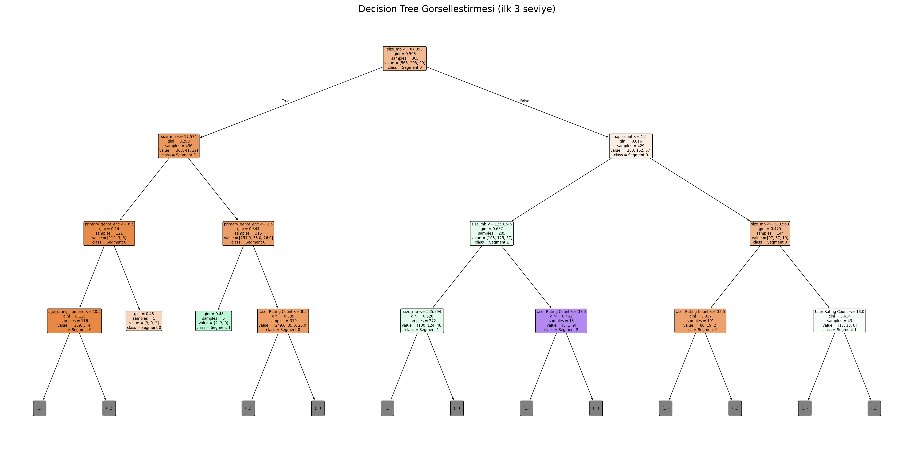
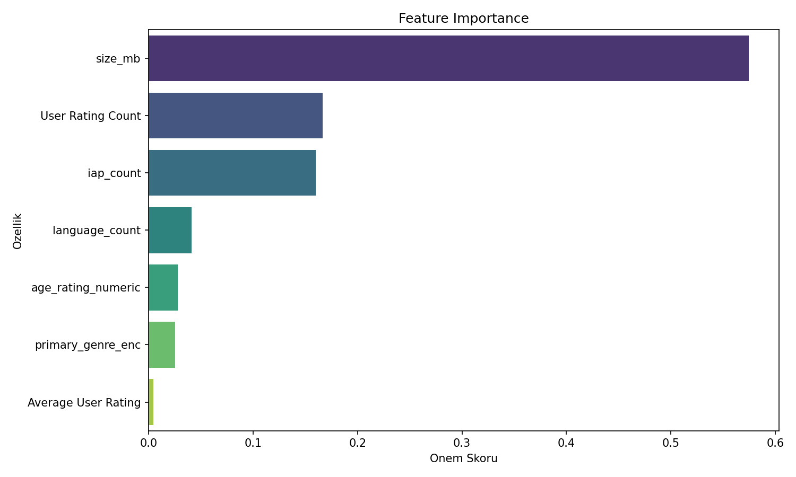
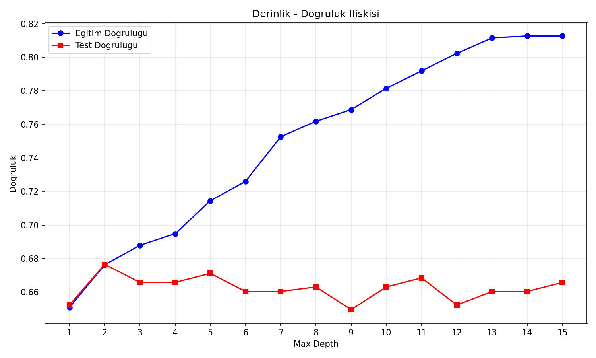

# Mobil Oyun Fiyat Segmenti Sınıflandırması — Oyun Versiyonu

## 🎓 Bu Proje Hakkında

Bu çalışmanın amacı, bir Decision Tree ile fiyat segmenti sınıflandırması
yapmaktır: **mobil oyunun** özellik setinden (kullanıcı puanı, puan
sayısı, boyut, yaş sınırı, dil sayısı, içi satın alma sayısı) fiyat
segmenti tahmin ediliyor. `qcut` ile 4 çeyreklik bölme ve derinlik/doğruluk
karşılaştırma analizleri (overfitting kontrolü, `max_depth` taraması)
uygulanır.

## 📊 Veri Seti

**Kaggle:** `tristan581/17k-apple-app-store-strategy-games` — gerçek mobil
oyun kataloğu.

## 🚀 Çalıştırma

```bash
pip install -r requirements.txt
python mobile_price_decision_tree.py
```

## 📊 Sonuçlar (gerçek çalıştırma — 1.236 mobil oyun)

**Not:** `qcut` fiyat dağılımındaki tekrarlı sınır değerleri nedeniyle
4 yerine **3 segment** üretti (Segment 0: 805, Segment 1: 290, Segment 2:
141 oyun) — gerçek verinin doğal bir sonucu.

| Derinlik | Test Accuracy |
|---|---|
| Varsayılan (budanmamış) | %66.0 |
| **max_depth=2 (en iyi)** | **%67.7** |

Eğitim (%72.6) ve test (%66.0) doğruluğu arasındaki fark makul — belirgin
overfitting yok. En önemli özellik **`size_mb`** (dosya boyutu, %57
önem) — pahalı oyunlar genelde daha büyük/gelişmiş prodüksiyonlar.

| | |
|---|---|
|  |  |
|  |  |

## 🛠️ Kullanılan Teknolojiler

`Python` · `scikit-learn` · `pandas` · `matplotlib` · `seaborn` · `kagglehub`

<p align="center"><i>Öğrenme sürecinde egzersiz olarak hazırlanmış bir versiyondur.</i></p>
