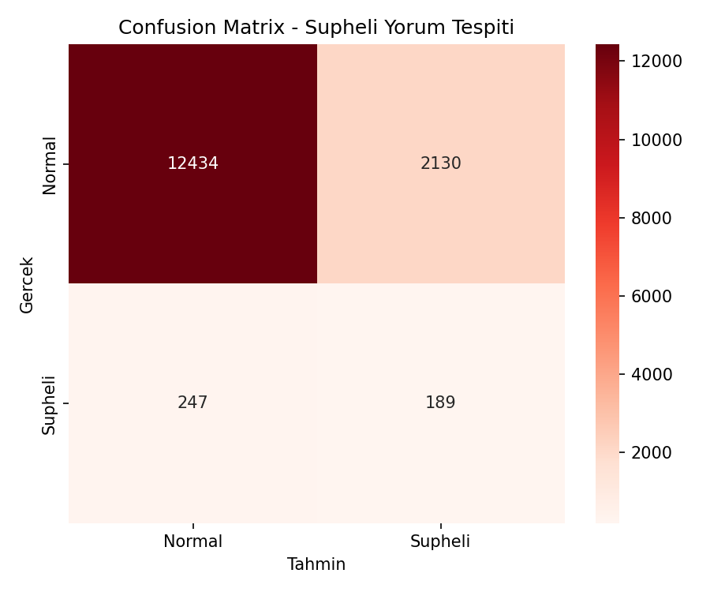
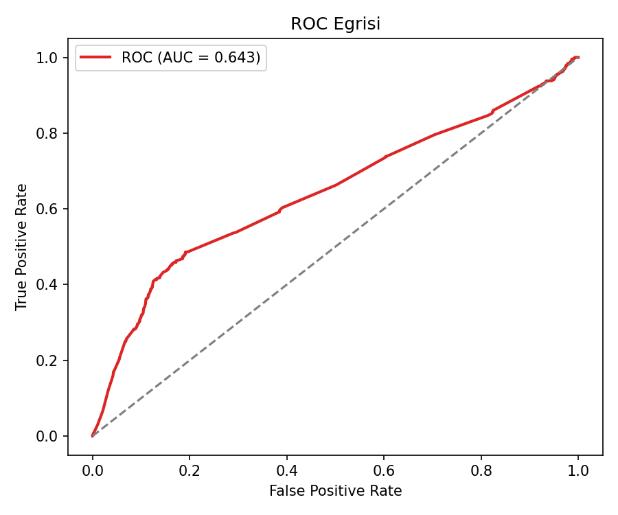
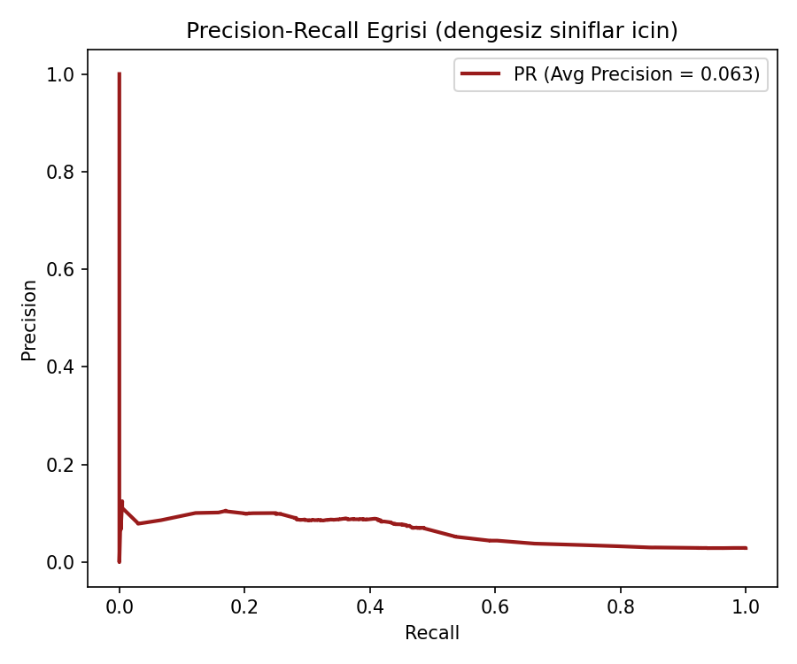
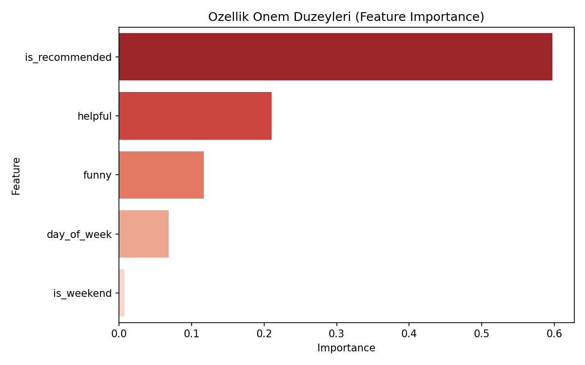

# Şüpheli Oyun Yorumu Tespiti (Fraud Detection RF — Oyun Versiyonu)

## 🎓 Bu Proje Hakkında

Bu çalışmanın amacı, dengesiz sınıflarla çalışan bir Random Forest
sınıflandırması kurmaktır.

Burada gerçekçi bir Steam yorum-kalitesi sinyali hedefleniyor: bir
kullanıcının oyunu **neredeyse hiç oynamadan** (0.5 saatten az)
yorum/tavsiye bırakması — gerçek platformlarda bot hesaplar/sahte yorumlar
için tipik bir işarettir. Bu bir **azınlık sınıf** problemidir.

## 📊 Veri Seti

**Kaggle:** `antonkozyriev/game-recommendations-on-steam` (`recommendations.csv`)

## 🚀 Çalıştırma

```bash
pip install -r requirements.txt
python fraud_detection_rf.py
```

## 📊 Sonuçlar (gerçek çalıştırma — 60.000 yorum, %2.9 şüpheli oran)

| Metrik | Değer |
|---|---|
| Accuracy | %84.2 |
| ROC-AUC | 0.643 |
| Şüpheli sınıf recall | 0.43 |
| Şüpheli sınıf precision | 0.08 |

`class_weight="balanced"` sayesinde model şüpheli yorumların %43'ünü
yakalayabiliyor (dengesiz veride bu iyi bir sonuç), ama precision düşük
(0.08) — yani işaretlenen "şüpheli" yorumların çoğu aslında normal.
Gerçek dünyada bu tür sistemler genelde bir ön-filtre olarak kullanılır;
işaretlenenler insan moderasyonuna gider, precision'ın düşük olması kabul
edilebilir bir maliyet.

| | |
|---|---|
|  |  |
|  |  |

## 🛠️ Kullanılan Teknolojiler

`Python` · `scikit-learn` · `pandas` · `matplotlib` · `seaborn` · `kagglehub`

<p align="center"><i>Öğrenme sürecinde egzersiz olarak hazırlanmış bir versiyondur.</i></p>
