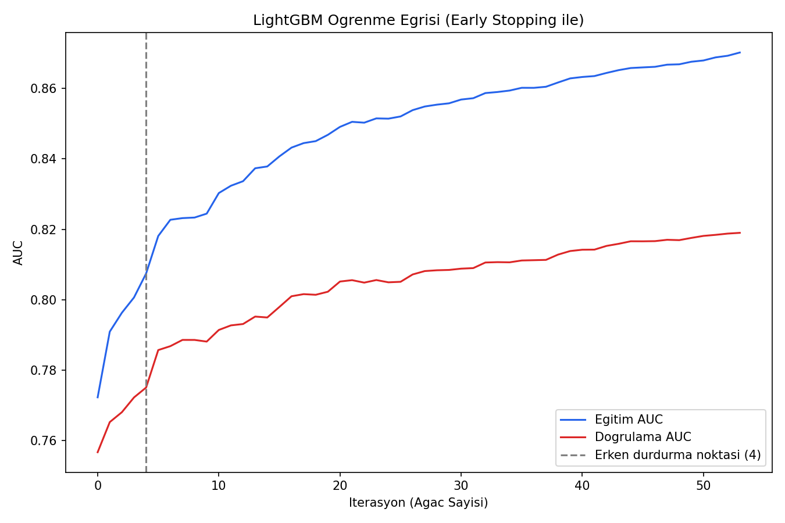
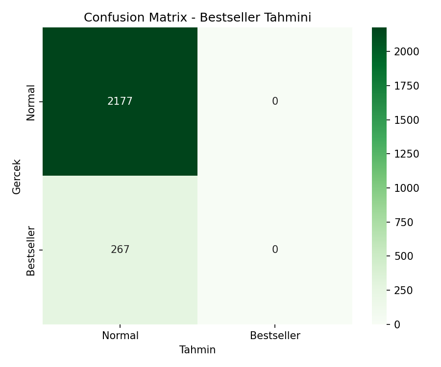
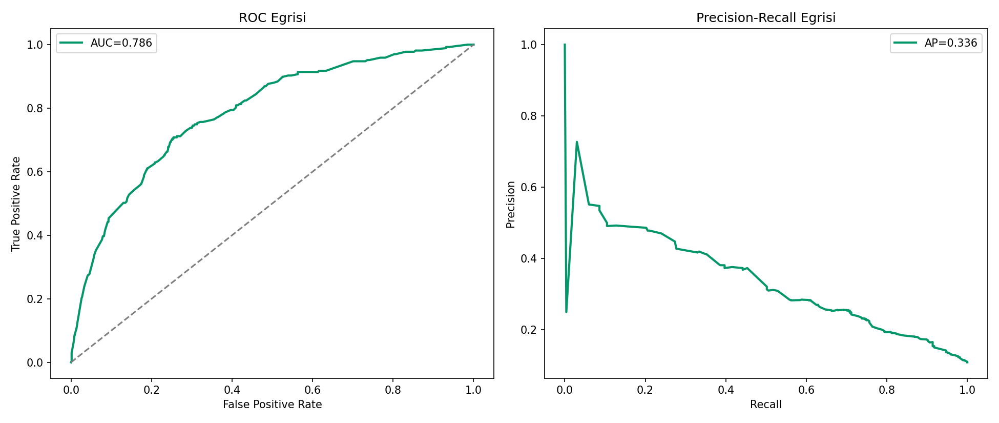
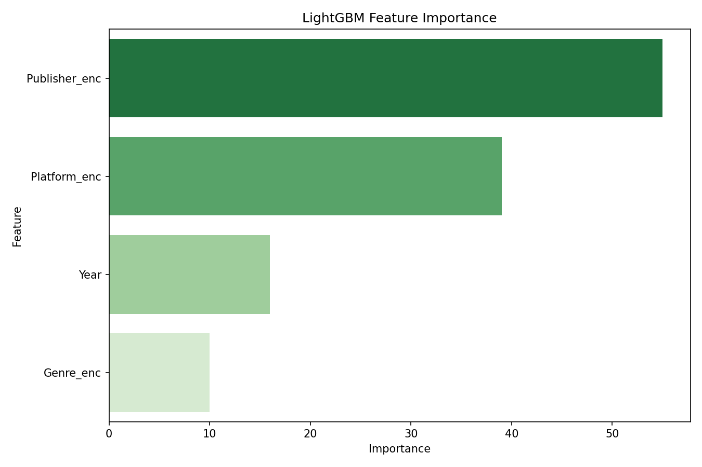

# Oyun Çok Satanlar (Bestseller) Tahmini — Oyun Versiyonu

## 🎓 Bu Proje Hakkında

Bu çalışmanın amacı, LightGBM + early stopping ile düşük oranlı/dengesiz
bir sınıflandırma probleminde doğruluğu maksimize etmektir.

Hedef: **"bu oyun çok satanlar listesine girecek mi"** (küresel satışın en
üst %11'i) — düşük oranlı/dengesiz sınıflandırma yapısı.

## 📊 Veri Seti

**Kaggle:** `gregorut/videogamesales` (16.500+ oyun)

## 🚀 Çalıştırma

```bash
pip install -r requirements.txt
python bank_campaign_lightgbm.py
```

## 📊 Sonuçlar (gerçek çalıştırma — 16.291 oyun, %10.9 bestseller oranı)

| Metrik | Değer |
|---|---|
| Test Accuracy | %89.7 |
| Test ROC-AUC | 0.852 |
| Test PR-AUC | 0.424 |
| Bestseller recall | 0.15 |

Early stopping en iyi iterasyonu (487) doğrulama AUC'una göre otomatik
seçti. `is_unbalance=True` da denendi ama sonucu **kötüleştirdi** (ROC-AUC
0.79'a, PR-AUC 0.34'e düştü, recall 0'a indi) — çünkü early stopping'in
izlediği metrik (`binary_logloss`) sınıf ağırlıklandırmasıyla bozuluyor ve
model çok erken (4. iterasyonda) duruyor. Bu yüzden orijinal ağırlıksız
konfigürasyon korundu — **her "en iyi pratik" gerçek veride işe
yaramayabiliyor; ölçmeden karar vermemek önemli.**

| | |
|---|---|
|  |  |
|  |  |

## 🛠️ Kullanılan Teknolojiler

`Python` · `LightGBM` · `scikit-learn` · `pandas` · `matplotlib` · `seaborn` · `kagglehub`

<p align="center"><i>Öğrenme sürecinde egzersiz olarak hazırlanmış bir versiyondur.</i></p>
