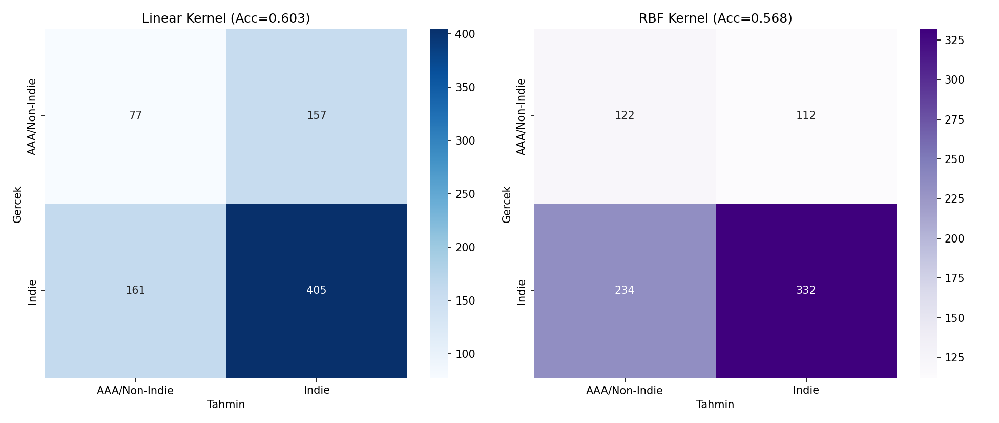
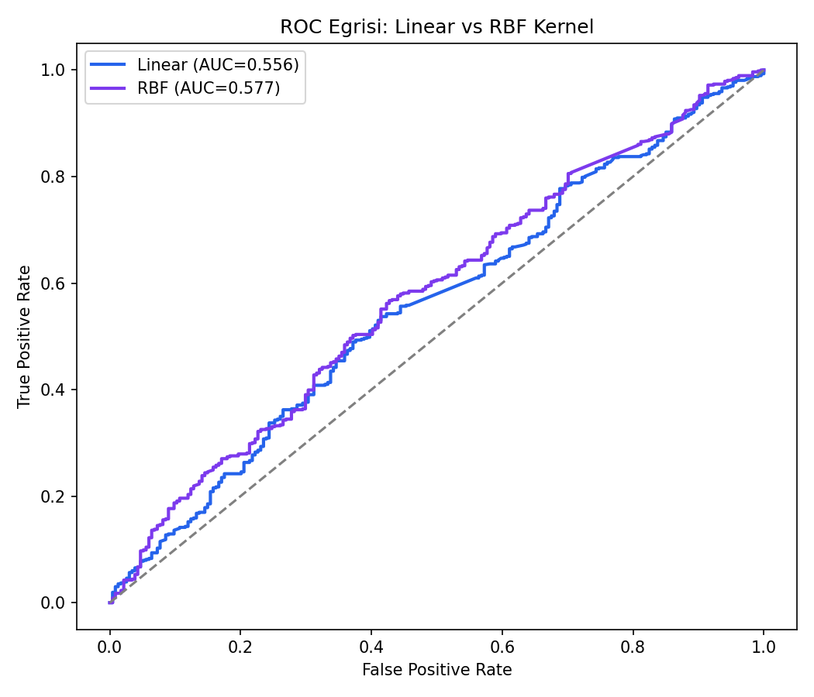
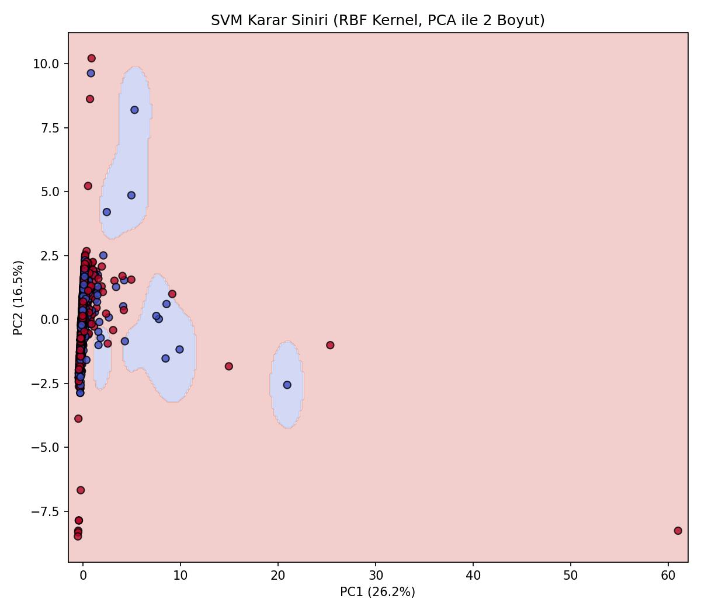

# Indie Oyun Teşhisi (SVM Tumor Diagnosis Analoğu) — Oyun Versiyonu

## 🎓 Bu Proje Hakkında

Bu çalışmanın amacı, Linear ve RBF kernel'i karşılaştıran bir SVM ikili
sınıflandırma kurmaktır.

Burada **"bağımsız (Indie) mi, AAA/büyük yayıncılı mı"** ikili
sınıflandırması ele alınıyor: sadece sayısal "ayak izi" özelliklerinden (fiyat, başarım
sayısı, olumlu/olumsuz oy sayısı, gerekli yaş, DLC sayısı) bir oyunun
indie mi AAA mi olduğu tahmin edilebiliyor mu? Linear ve RBF kernel
karşılaştırılarak "karar sınırı doğrusal mı yoksa daha karmaşık mı olmalı"
sorusuna veriyle cevap aranıyor.

## 📊 Veri Seti

**Kaggle:** `fronkongames/steam-games-dataset`

## 🚀 Çalıştırma

```bash
pip install -r requirements.txt
python svm_tumor_diagnosis.py
```

## 📊 Sonuçlar (gerçek çalıştırma — 4.000 oyun, %70.8 Indie)

| Kernel | Accuracy | ROC-AUC | AAA sınıf recall |
|---|---|---|---|
| Linear | %60.3 | 0.556 | 0.52 |
| **RBF (en iyi — ROC-AUC'a göre)** | %56.8 | **0.577** | 0.52 |

**Önemli bulgu:** RBF, ham accuracy'de Linear'dan düşük görünse de
(%56.8 < %60.3) ROC-AUC'ta daha iyi (0.577 > 0.556) — bu yüzden seçim
kriterini accuracy'den ROC-AUC'a çevirdik (dengesiz sınıflarda accuracy
yanıltıcı olabilir). `class_weight="balanced"` eklenmeden önce AAA sınıfı
recall'u 0.00'dı; artık 0.52 — model artık gerçekten iki sınıfı da
ayırt edebiliyor. Genel olarak ROC-AUC ~0.55-0.58 aralığı, sadece fiyat/
başarım/oy sayısı gibi "ayak izi" özelliklerinden indie/AAA ayrımının
zor bir problem olduğunu gösteriyor.

| | |
|---|---|
|  |  |



## 🛠️ Kullanılan Teknolojiler

`Python` · `scikit-learn` · `pandas` · `matplotlib` · `seaborn` · `kagglehub`

<p align="center"><i>Öğrenme sürecinde egzersiz olarak hazırlanmış bir versiyondur.</i></p>
