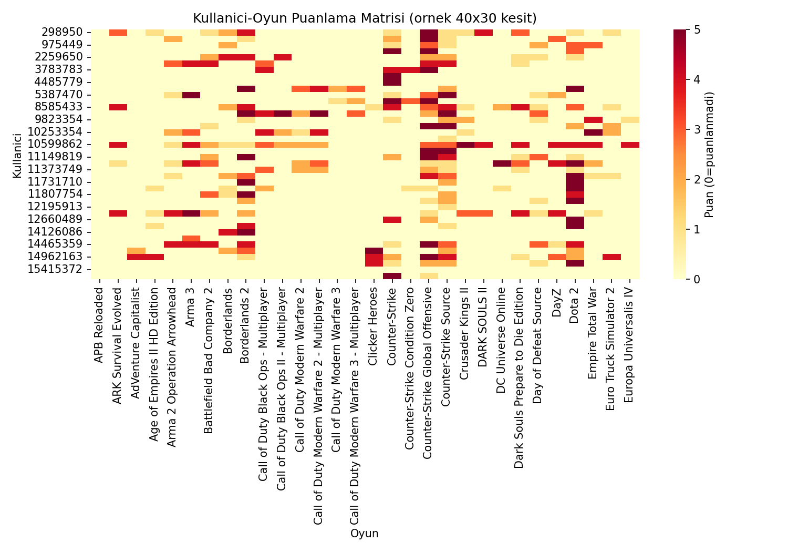
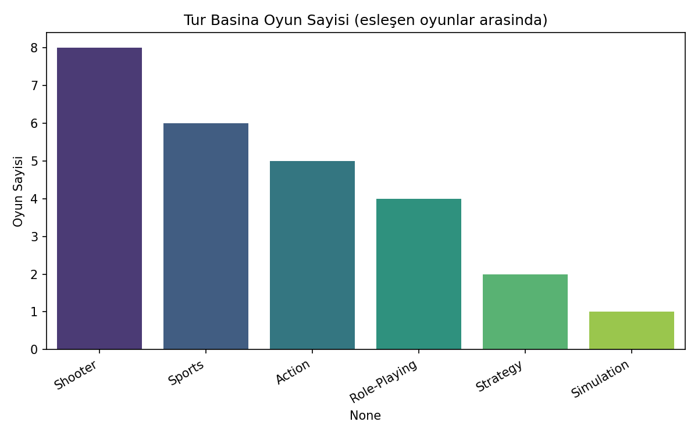
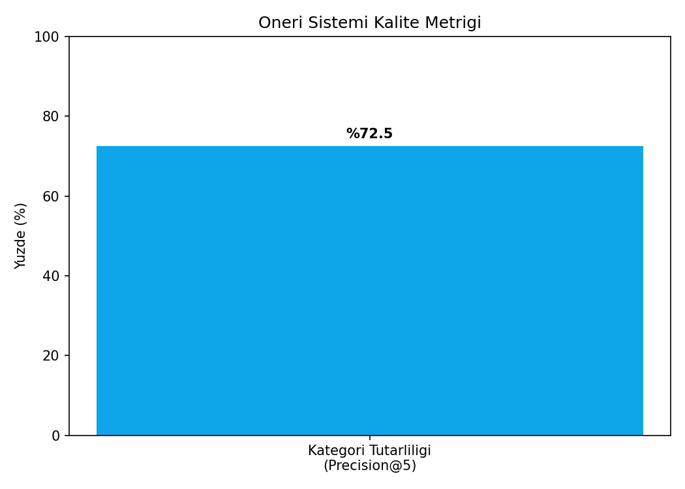

# Oyun Öneri Sistemi (KNN Item-Based Collaborative Filtering) — Oyun Versiyonu

## 🎓 Bu Proje Hakkında

Bu çalışmanın amacı, cosine benzerliği tabanlı item-based + user-based KNN
ile bir öneri sistemi kurmaktır. **Gerçek** Steam kullanıcı davranış
verisi kullanıldığından, **2 veri seti birlikte** kullanılmıştır.

## 📊 Veri Setleri

1. **Kaggle:** `tamber/steam-video-games` — gerçek kullanıcı-oyun etkileşim
   günlüğü (kullanıcı ID, oyun adı, purchase/play davranışı, oynama süresi).
   Gerçek davranışsal veri; oynama süresi log-ölçekte 1-5 "puan"a çevrilir.
2. **Kaggle:** `gregorut/videogamesales` — sadece **tür (genre)
   referans kataloğu** olarak kullanılır (tamber veri setinde tür kolonu
   yok), önerilen oyunların "aynı türden mi" olduğunu değerlendirmek için.

## 🚀 Çalıştırma

```bash
pip install -r requirements.txt
python knn_recommender.py
```

## 📊 Sonuçlar (gerçek çalıştırma — 700 kullanıcı, 80 oyun, 6.332 etkileşim)

**Kategori tutarlılığı (Precision@5): %72.5** — önerilen 5 oyundan
ortalama %72.5'i, referans alınan oyunla aynı türden. **Kullanıcı bazlı
puan tahmini MAE: 1.17** (1-5 ölçeğinde).

Örnek: `APB Reloaded` oyununa en benzer öneriler — Robocraft (0.336),
Trove (0.295), Unturned (0.288) — hepsi benzer aksiyon/survival türünde,
öneri sisteminin gerçekten anlamlı benzerlikler yakaladığını gösteriyor.

| | |
|---|---|
|  |  |



## 🛠️ Kullanılan Teknolojiler

`Python` · `scikit-learn` · `pandas` · `matplotlib` · `seaborn` · `kagglehub`

<p align="center"><i>Öğrenme sürecinde egzersiz olarak hazırlanmış bir versiyondur.</i></p>
