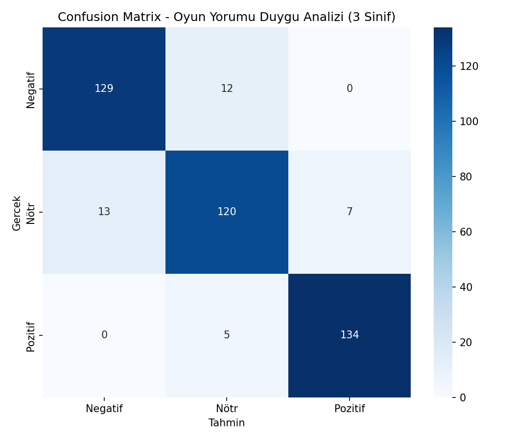
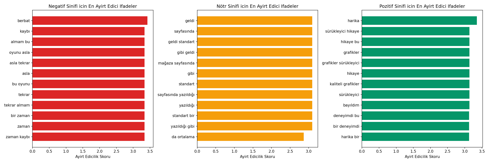

# Oyun Yorumu Duygu Analizi (Naive Bayes) — Oyun Versiyonu

## 🎓 Bu Proje Hakkında

Bu çalışmanın amacı, TF-IDF + Multinomial Naive Bayes ile 3-sınıflı duygu
analizi yapmaktır.

**Veri seti notu:** Paylaşılan 9 Kaggle veri setinden hiçbiri ham yorum
metni içermiyor (`antonkozyriev/game-recommendations-on-steam` bile sadece
oy/tavsiye meta verisi tutuyor, gerçek yorum cümlelerini değil). Bu yüzden
görev tanımındaki istisna uygulanarak, sentetik şablon tekniğiyle **oyun
yorumu** metinleri üretilmiştir.

## 🚀 Çalıştırma

```bash
pip install -r requirements.txt
python sentiment_naive_bayes.py
```

Herhangi bir indirme/kimlik doğrulama gerektirmez.

## 📊 Sonuçlar (gerçek çalıştırma — 2.100 yorum, 3 sınıf dengeli)

**Test Accuracy: %91.2** — negatif (F1=0.91), nötr (F1=0.87), pozitif
(F1=0.96) sınıflarının hepsinde güçlü performans.

En ayırt edici kelimeler beklenen şekilde çıktı: negatif için "berbat",
"zaman kaybı", "asla"; pozitif için "harika", "bayıldım", "kaliteli
grafikler" — model gerçekten anlamlı dilsel sinyalleri öğrenmiş.

| | |
|---|---|
|  |  |

## 🛠️ Kullanılan Teknolojiler

`Python` · `scikit-learn` (TF-IDF, MultinomialNB) · `pandas` · `matplotlib` · `seaborn`

<p align="center"><i>Öğrenme sürecinde egzersiz olarak hazırlanmış bir versiyondur.</i></p>
