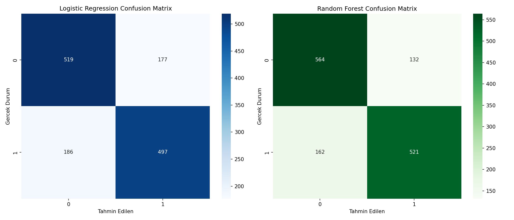
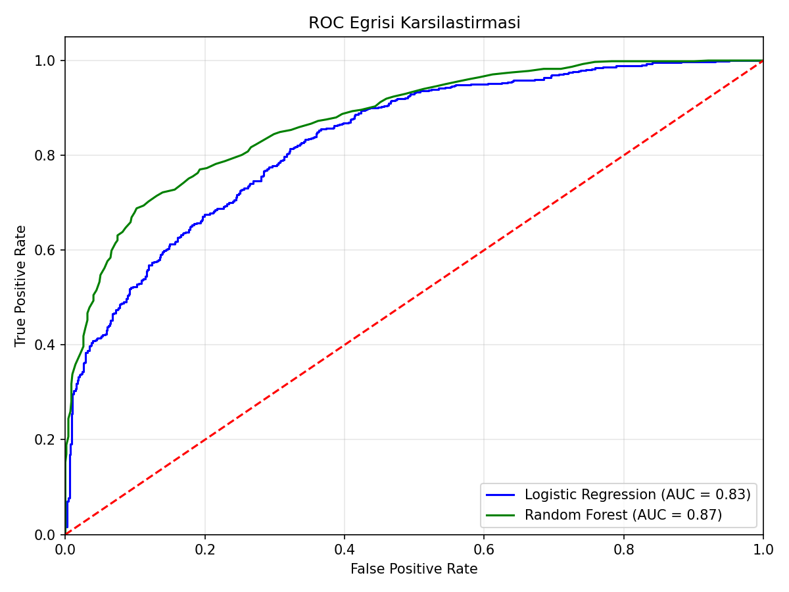
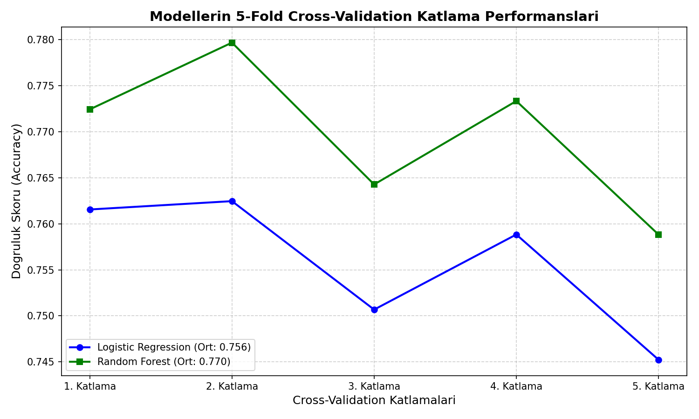

# Model Karşılaştırma: Logistic Regression vs Random Forest — Oyun Versiyonu

## 🎓 Bu Proje Hakkında

Bu çalışmanın amacı, Logistic Regression vs Random Forest kıyaslamasını
5-Fold Cross-Validation ile "hangi model gerçekten güvenilir" sorusuna
odaklanarak yapmaktır.

Hedef: **"bu oyun yüksek eleştirmen puanı aldı mı"** (Critic_Score, medyan
üzeri) ikili sınıflandırması. "Tek train/test split'in şansa bağlı
olabileceği, CV'nin daha güvenilir olduğu" karşılaştırma çerçevesi esas
alınır.

## 📊 Veri Seti

**Kaggle:** `rush4ratio/video-game-sales-with-ratings`

## 🚀 Çalıştırma

```bash
pip install -r requirements.txt
python ml_comparison.py
```

## 📊 Sonuçlar (gerçek çalıştırma — 6.894 oyun, dengeli sınıf dağılımı)

| Model | Tek Test Accuracy | 5-Fold CV Ortalama | CV Std | ROC-AUC |
|---|---|---|---|---|
| Logistic Regression | %73.7 | %75.6 | 0.0067 | 0.833 |
| **Random Forest** | **%78.7** | **%77.0** | 0.0073 | **0.874** |

Random Forest her metrikte Logistic Regression'ı geçiyor — doğrusal
olmayan özellik etkileşimlerini yakalayabilmesi avantaj sağlıyor. CV
ortalaması, tek train/test split sonucuna göre daha düşük ve daha
istikrarlı (düşük std) — tek split'in şansa bağlı olabileceği mesajını
doğruluyor.

| | |
|---|---|
|  |  |



## 🛠️ Kullanılan Teknolojiler

`Python` · `scikit-learn` · `pandas` · `matplotlib` · `seaborn` · `kagglehub`

<p align="center"><i>Öğrenme sürecinde egzersiz olarak hazırlanmış bir versiyondur.</i></p>
