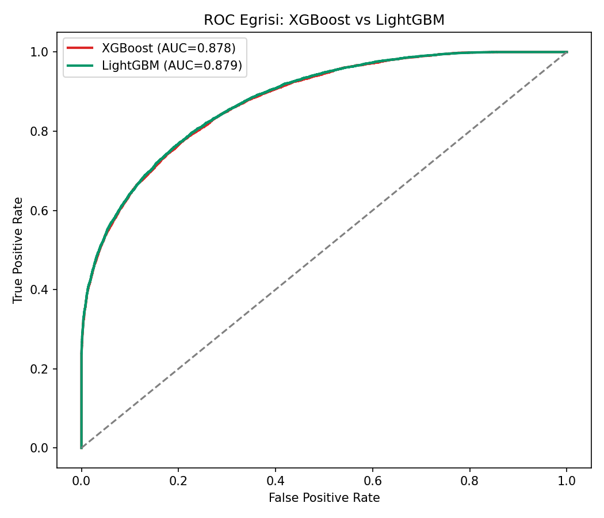
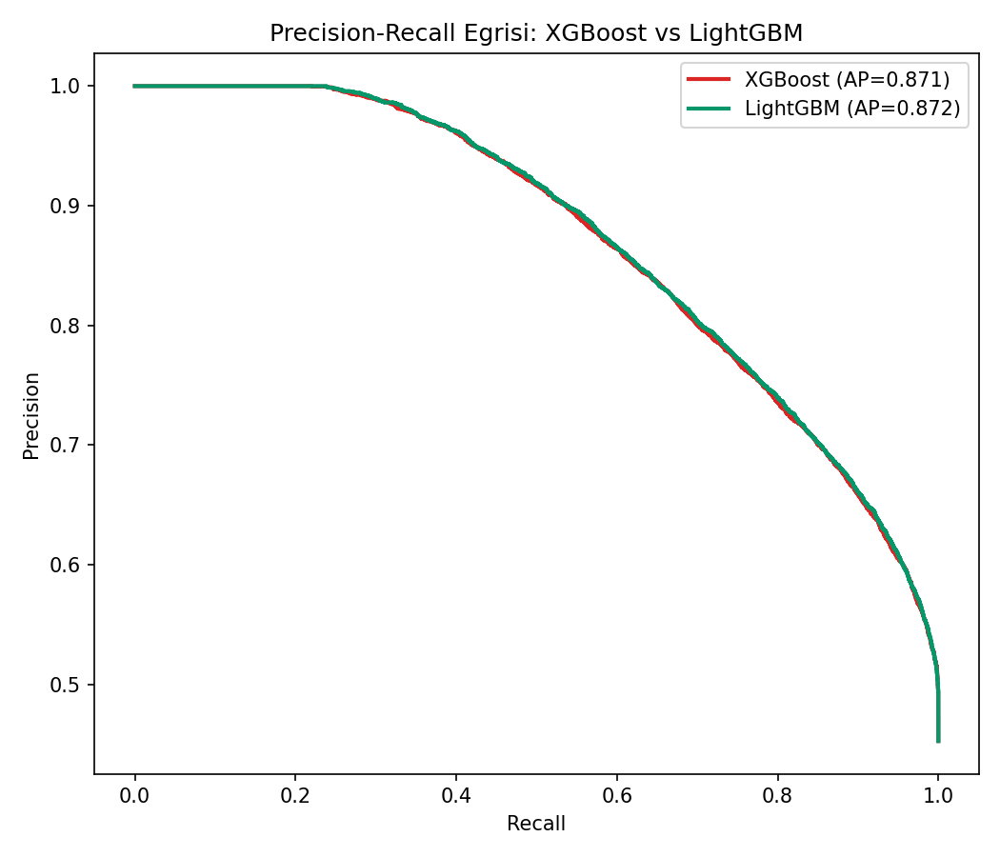
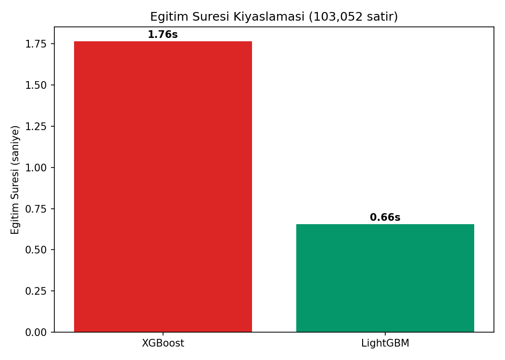
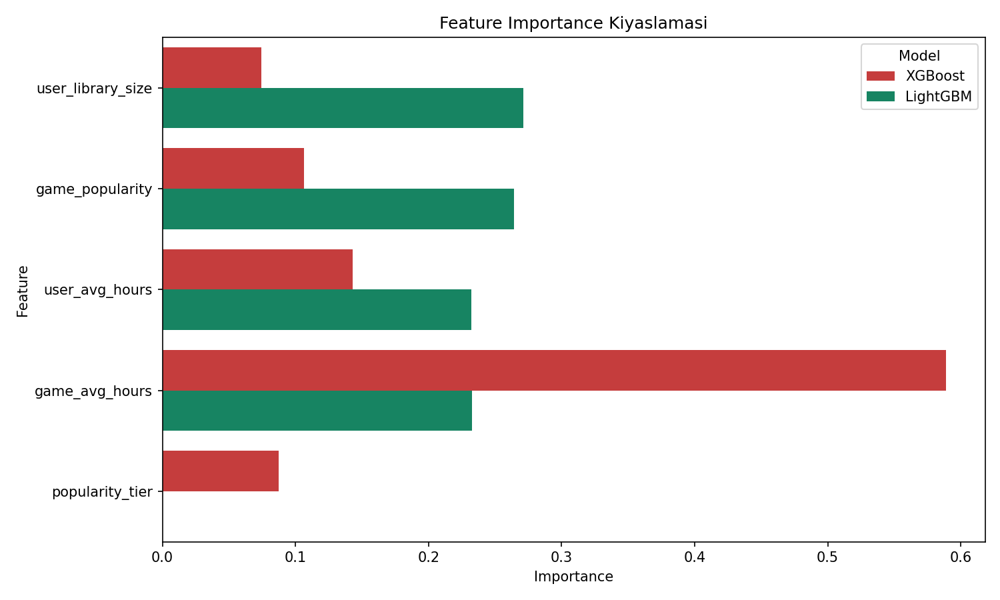

# Satın Alma Sonrası Oynanmama (CTR Analoğu) Tahmini: XGBoost vs LightGBM

## 🎓 Bu Proje Hakkında

Bu çalışmanın amacı, XGBoost ve LightGBM'i aynı veride hız ve doğruluk
açısından kıyaslamaktır.

Hedef gerçek bir
Steam davranış sinyaline karşılık geliyor: **"kullanıcı satın aldığı oyunu
hiç oynamadı mı"** (raftaki oyun / backlog fenomeni) — "bir eylemden
(tıklama/satın alma) sonra beklenen ikinci eylemin (dönüşüm/oynama)
gerçekleşip gerçekleşmediği" yapısı birebir aynıdır.

## 📊 Veri Seti

**Kaggle:** `tamber/steam-video-games` — gerçek kullanıcı-oyun satın alma
ve oynama günlüğü.

## 🚀 Çalıştırma

```bash
pip install -r requirements.txt
python ctr_xgboost_vs_lightgbm.py
```

## 📊 Sonuçlar (gerçek çalıştırma — 128.816 kayıt, %45.3 oynanmama oranı)

| Model | Accuracy | ROC-AUC | PR-AUC | Eğitim Süresi |
|---|---|---|---|---|
| XGBoost | %78.5 | 0.878 | 0.871 | 1.76s |
| **LightGBM** | **%78.7** | **0.879** | **0.872** | **0.66s (4x hızlı)** |

İki model neredeyse özdeş doğruluk veriyor, ama **LightGBM 2.7 kat daha
hızlı eğitiliyor** — büyük ölçekli/gerçek zamanlı senaryolarda (CTR
tahmini gibi) bu fark pratikte önemli bir avantaj.

| | |
|---|---|
|  |  |
|  |  |

## 🛠️ Kullanılan Teknolojiler

`Python` · `XGBoost` · `LightGBM` · `scikit-learn` · `pandas` · `matplotlib` · `seaborn` · `kagglehub`

<p align="center"><i>Öğrenme sürecinde egzersiz olarak hazırlanmış bir versiyondur.</i></p>
