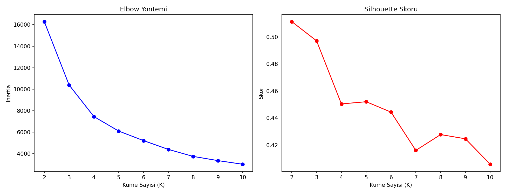
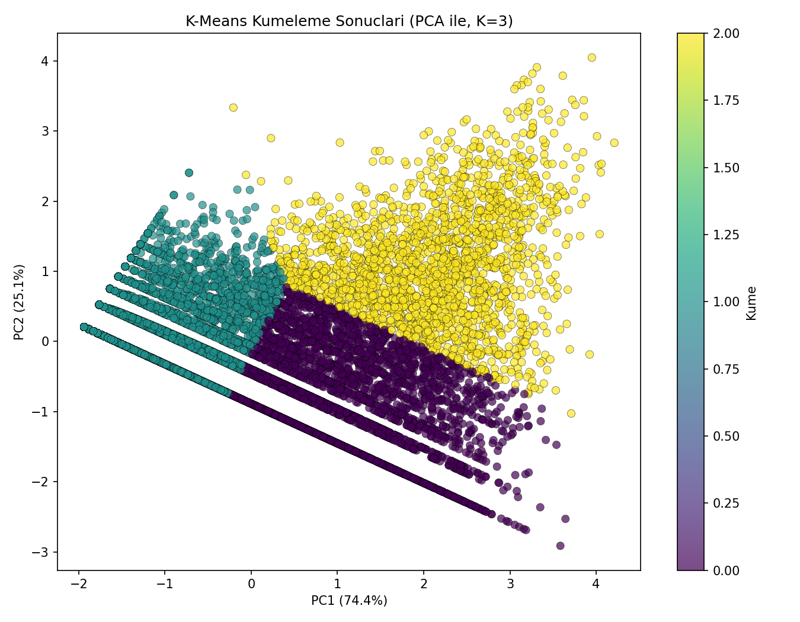

# Oyuncu Segmentasyonu (K-Means + PCA) — Oyun Versiyonu

## 🎓 Bu Proje Hakkında

Bu çalışmanın amacı, K-Means + PCA ile davranışsal segmentasyon yapmak,
Elbow + Silhouette ile optimal K'yı bulmak ve iş bağlamında K seçimini
yorumlamaktır.

**Oyuncular** kütüphanelerindeki oyun sayısına, toplam oynama süresine ve
ortalama oyun başına saate göre segmentleniyor (casual / düzenli /
hardcore oyuncu).

## 📊 Veri Seti

**Kaggle:** `tamber/steam-video-games` — gerçek kullanıcı-oyun etkileşim
günlüğü.

## 🚀 Çalıştırma

```bash
pip install -r requirements.txt
python ecommerce_segmentation.py
```

## 📊 Sonuçlar (gerçek çalıştırma — 12.393 oyuncu)

İstatistiksel olarak en iyi Silhouette skoru K=2'de (0.511) ama K=3
(Silhouette=0.497) iş bağlamı gerekçesiyle seçildi — neredeyse eşit skor
karşılığında çok daha aksiyona dönüştürülebilir bir segmentasyon sağlıyor:

| Küme | Oyuncu Sayısı | Ort. Oyun Sayısı | Ort. Toplam Saat | Profil |
|---|---|---|---|---|
| 0 | 3.682 | 3.2 | 337h | Düzenli oyuncu |
| 1 | 6.738 | 2.2 | 4h | Casual/pasif |
| 2 | 1.973 | 52.1 | 1.102h | Hardcore koleksiyoncu |

PCA 2 bileşenle varyansın **%99.4'ünü** açıklıyor — görselleştirme gerçek
yapıyı yüksek doğrulukla yansıtıyor.

| | |
|---|---|
|  |  |

## 🛠️ Kullanılan Teknolojiler

`Python` · `scikit-learn` · `pandas` · `matplotlib` · `seaborn` · `kagglehub`

<p align="center"><i>Öğrenme sürecinde egzersiz olarak hazırlanmış bir versiyondur.</i></p>
