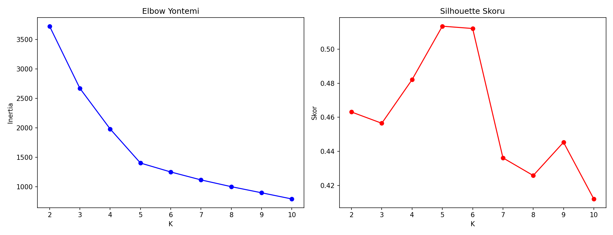
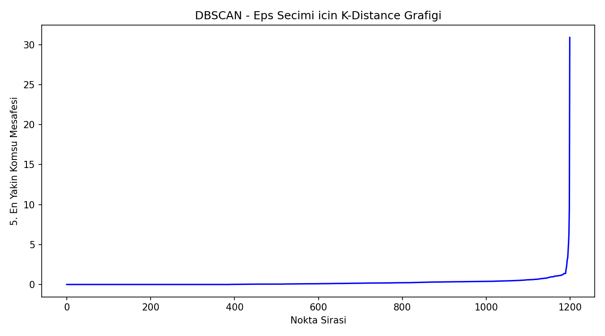
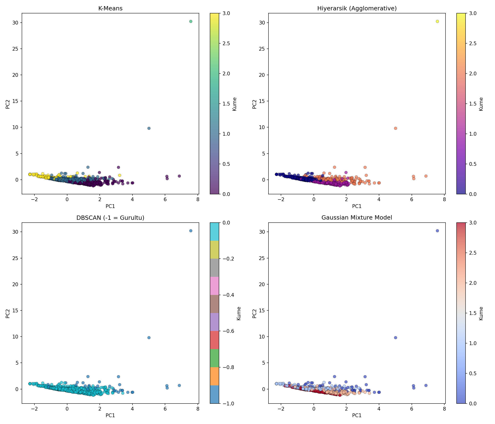

# Oyun Pazarı Segmentasyonu (4 Algoritma Karşılaştırması) — Oyun Versiyonu

## 🎓 Bu Proje Hakkında

Bu çalışmanın amacı, 4 farklı kümeleme algoritmasını (K-Means, Hiyerarşik,
DBSCAN, GMM) aynı veri seti üzerinde uygulayıp karşılaştırmaktır.

**Oyunlar** fiyat/başarım sayısı/ortalama oynanma süresi/beğeni oranına
göre kümeleniyor.

## 📊 Veri Seti

**Kaggle:** `fronkongames/steam-games-dataset` — bu veri setinde "0" çoğu
zaman "hiç izlenmemiş/ölçülmemiş" anlamına geldiğinden, `Average_Playtime`
kolonundaki sıfırlar eksik değer olarak ele alınıp medyanla dolduruluyor.

## 🚀 Çalıştırma

```bash
pip install -r requirements.txt
python insurance_segmentation.py
```

## 📊 Sonuçlar (gerçek çalıştırma — 1.200 oyun, K=4)

| Algoritma | Silhouette Skoru | Küme Sayısı |
|---|---|---|
| **K-Means** | **0.482** (en iyi) | 4 |
| Hiyerarşik (Agglomerative) | 0.404 | 4 |
| Gaussian Mixture Model | 0.214 | 4 |
| DBSCAN | — | 1 (kümeleyemedi) |

K-Means en net ayrımı veriyor. **DBSCAN varsayılan `eps`/`min_samples`
parametreleriyle tek bir küme + 42 gürültü noktası** üretti — bu veri
yoğunluk-tabanlı kümeleme için doğal olarak uygun değil (yoğunluk
farkları belirgin değil), parametre taraması yapılmadan DBSCAN'in bu tür
verilerde başarısız olabileceğinin gerçek bir örneği.

| | |
|---|---|
|  |  |



## 🛠️ Kullanılan Teknolojiler

`Python` · `scikit-learn` · `pandas` · `matplotlib` · `seaborn` · `kagglehub`

<p align="center"><i>Öğrenme sürecinde egzersiz olarak hazırlanmış bir versiyondur.</i></p>
