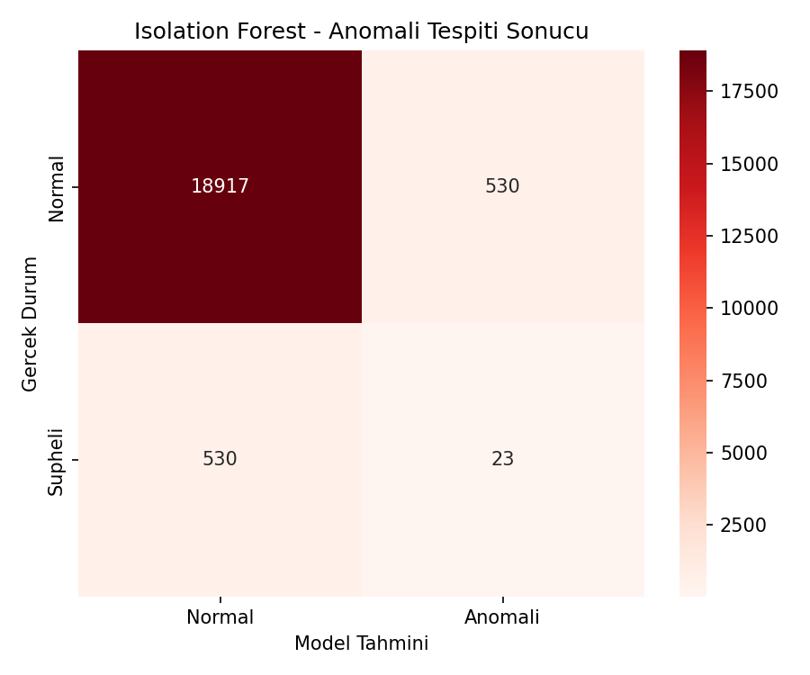
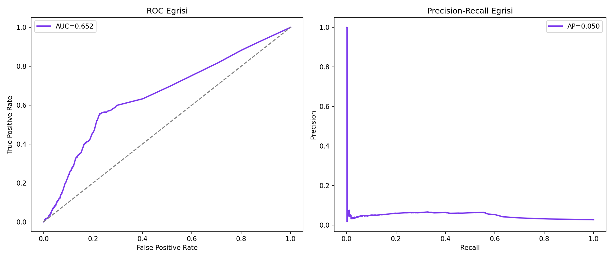
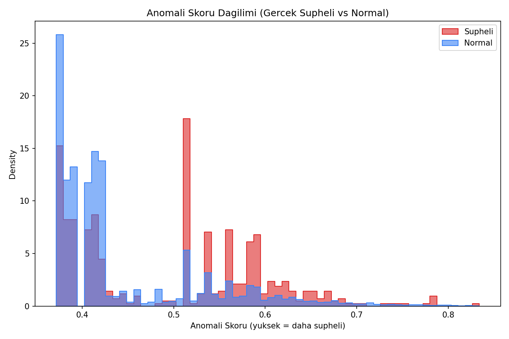
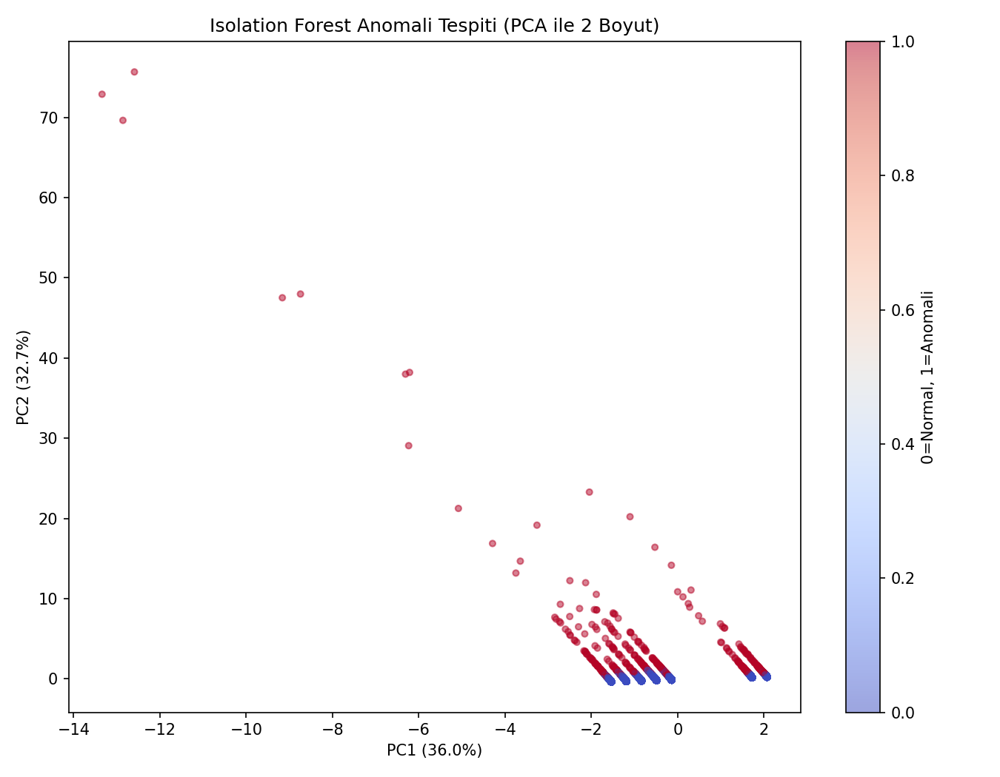

# Şüpheli Oyun Yorumu Anomali Tespiti (Isolation Forest) — Oyun Versiyonu

## 🎓 Bu Proje Hakkında

Bu çalışmanın amacı, ETİKET KULLANMADAN (unsupervised) anomali tespiti
yapan bir Isolation Forest kurmaktır.

Bu proje, [`Supervised/04-random-forest`](../../Supervised/04-random-forest)
projesiyle (şüpheli/sahte oyun yorumu tespiti) **tematik olarak
bağlantılıdır** — ikisi de "düşük oynama süresiyle bırakılan yorum"
örüntüsünü inceler, ama Random Forest projesi **etiketli (supervised)**
çalışırken, bu proje **hiçbir etiket görmeden (unsupervised)** çalışır.
Gerçek etiket sadece modelin başarısını değerlendirmek için kullanılır,
eğitimde hiç görülmez.

## 📊 Veri Seti

**Kaggle:** `antonkozyriev/game-recommendations-on-steam` (`recommendations.csv`)

## 🚀 Çalıştırma

```bash
pip install -r requirements.txt
python isolation_forest_fraud.py
```

## 📊 Sonuçlar (gerçek çalıştırma — 20.000 yorum, %2.77 gerçek şüpheli oran)

| Metrik | Değer |
|---|---|
| ROC-AUC | 0.652 |
| PR-AUC | 0.050 |
| Şüpheli sınıf recall | 0.04 |

**Beklenen ve öğretici bir sonuç:** Bu proje, etiketli
[`Supervised/04-random-forest`](../../Supervised/04-random-forest)
projesinin (ROC-AUC=0.643, recall=0.43) *aynı problemi* etiketsiz
çözmeye çalışır. Isolation Forest, gerçek etiketleri hiç görmeden ROC-AUC
açısından benzer bir sinyal yakalıyor (0.65 vs 0.64) ama **recall'da çok
daha zayıf** (0.04 vs 0.43) — hangi noktaların anormal olduğunu isaretlemek
konusunda etiketli öğrenmenin unsupervised yaklaşıma karşı büyük avantajı
olduğunu somut olarak gösteriyor.

| | |
|---|---|
|  |  |
|  |  |

## 🛠️ Kullanılan Teknolojiler

`Python` · `scikit-learn` · `pandas` · `matplotlib` · `seaborn` · `kagglehub`

<p align="center"><i>Öğrenme sürecinde egzersiz olarak hazırlanmış bir versiyondur.</i></p>
