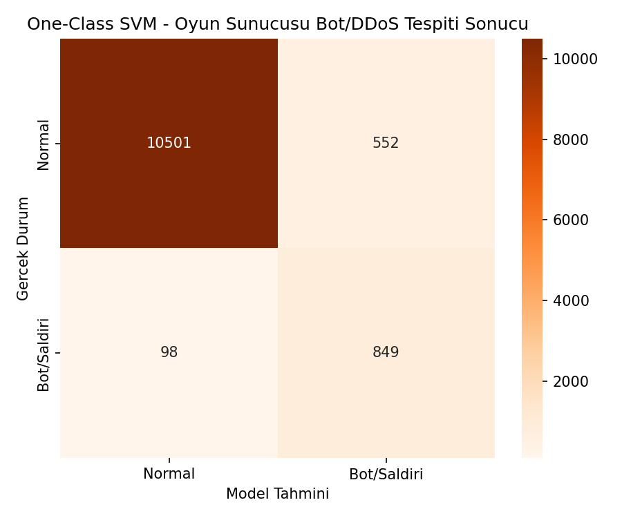
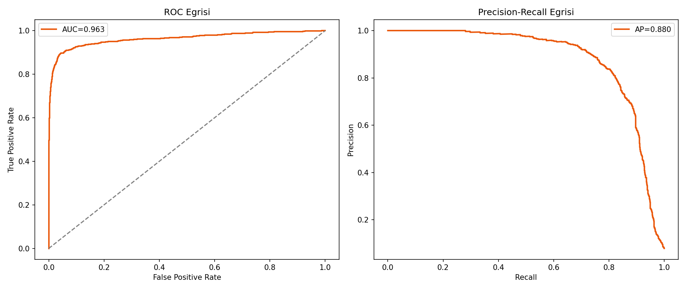
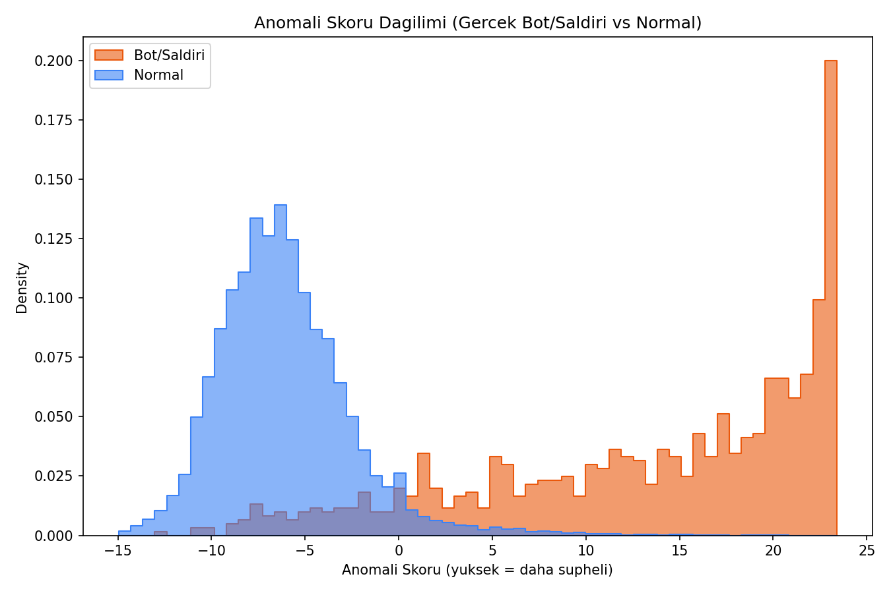
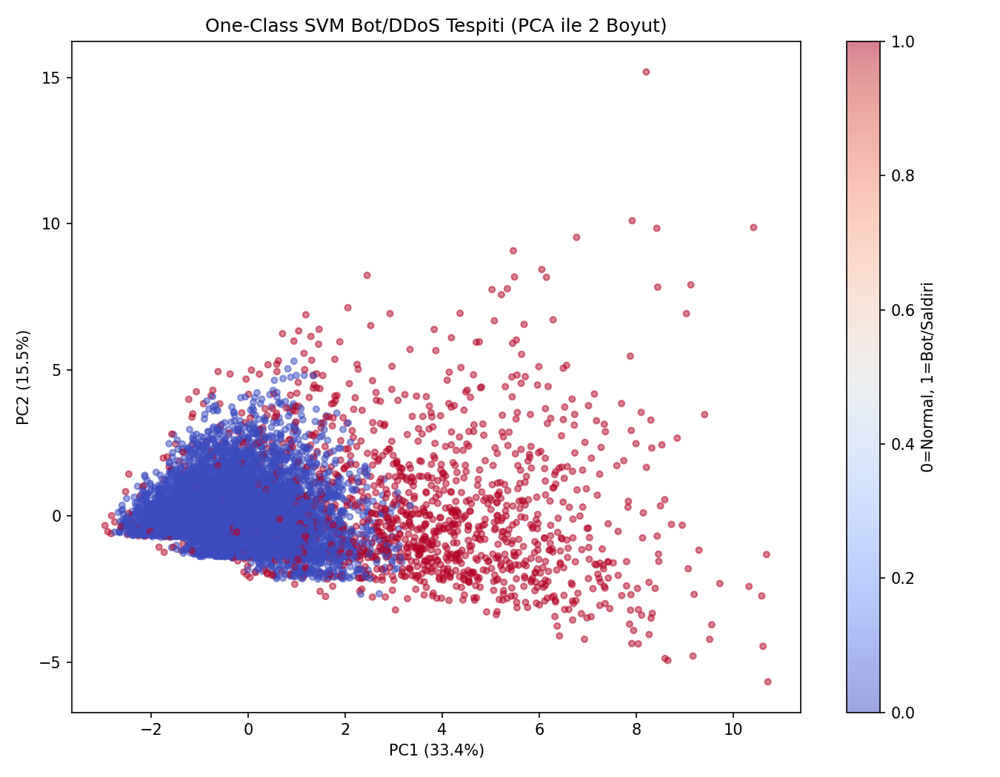

# Oyun Sunucusu Güvenliği — Bot/DDoS Trafiği Tespiti (One-Class SVM) — Oyun Versiyonu

## 🎓 Bu Proje Hakkında

Bu çalışmanın amacı, SADECE normal trafikle eğitilen bir One-Class SVM ile
anomali/saldırı tespiti yapmaktır.

**Veri seti notu:** Paylaşılan 9 Kaggle veri setinden hiçbiri ağ/sunucu
bağlantı telemetrisi (paket boyutu, oturum süresi, başarısız giriş sayısı
vb.) içermiyor — hepsi oyun katalog/satış/değerlendirme verisi. Gerçek bir
ağ trafiği veri seti de bulunmadığı için, görev tanımındaki istisna
uygulanarak sentetik veri üretiliyor; bağlam **"oyun sunucusu güvenliği /
bot-cheat-DDoS trafiği tespiti"**ne çevrilmiştir — ağ güvenliği kavramları
(paket, oturum, bağlantı) zaten doğrudan oyun sunucusu altyapısına
uygulanabilir.

Bu proje aynı zamanda
[`oyun-versiyonlari/BigData/big-data-log-analytics`](../../../BigData/big-data-log-analytics)
projesindeki oyun mağazası log analitiğiyle **tematik olarak
bağlantılıdır** — ikisi de oyun platformu sunucu/ağ trafiği verisiyle
ilgilenir.

## 🚀 Çalıştırma

```bash
pip install -r requirements.txt
python ocsvm_intrusion_detection.py
```

Herhangi bir indirme/kimlik doğrulama gerektirmez (sentetik veri).

## 📊 Sonuçlar (gerçek çalıştırma — 12.000 oturum, %7.9 gerçek bot/saldırı oranı)

| Metrik | Değer |
|---|---|
| ROC-AUC | **0.963** |
| PR-AUC | 0.880 |
| Bot/Saldırı recall | 0.90 |
| Bot/Saldırı precision | 0.61 |

Model **hiç bot/saldırı örneği görmeden** (sadece normal trafikle eğitilip)
gerçek bot/saldırı trafiğinin %90'ını yakalayabiliyor — One-Class SVM'in
"normalin sınırını öğrenme" yaklaşımının bu senaryoda güçlü çalıştığını
gösteriyor.

| | |
|---|---|
|  |  |
|  |  |

## 🛠️ Kullanılan Teknolojiler

`Python` · `scikit-learn` · `pandas` · `matplotlib` · `seaborn`

<p align="center"><i>Öğrenme sürecinde egzersiz olarak hazırlanmış bir versiyondur.</i></p>
