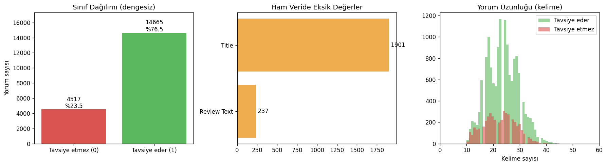
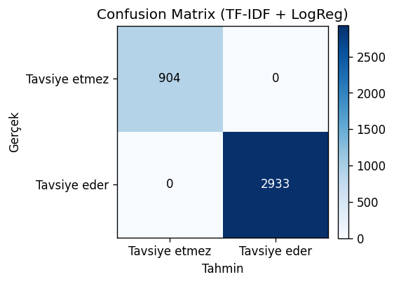
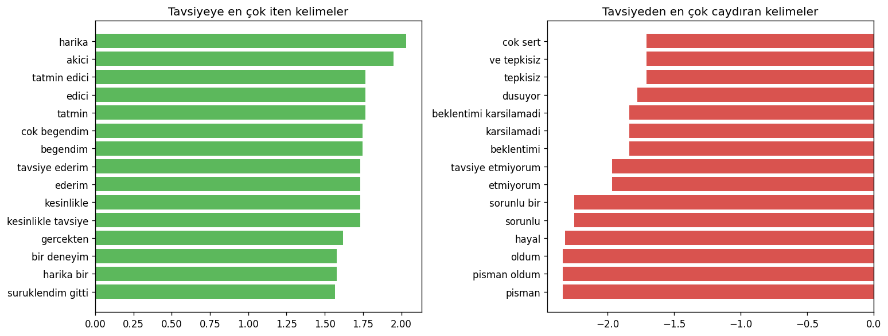
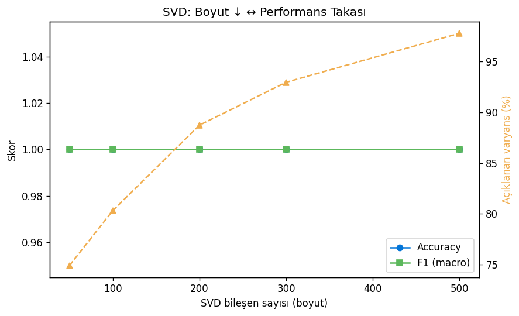

# Oyun Yorumu Tavsiye Tahmini (TF-IDF + Logistic Regression) — Oyun Versiyonu

## 🎓 Bu Proje Hakkında

Bu çalışmanın amacı, metin temizliği → EDA → TF-IDF+LogReg →
değerlendirme → SVD/LSA boyut indirgeme takas analizi işlem hattını
uçtan uca kurmaktır.

**Veri seti notu:** Paylaşılan 9 Kaggle veri setinden hiçbiri ham oyun
yorumu metni + "tavsiye eder mi" etiketini birlikte içermiyor (bkz.
[MachineLearning/Supervised/08-naive-bayes](../../MachineLearning/Supervised/08-naive-bayes)
README'sindeki aynı tespit). Bu yüzden aynı kolon yapısını (`Title`, `Review Text`, `Recommended IND`)
taklit eden, kasıtlı olarak gerçekçi "kirlilik" içeren (eksik başlık,
mükerrer yorum, boş yorum) daha büyük ölçekli **sentetik** bir oyun yorumu
veri seti üretiliyor — böylece temizlik/EDA adımları anlamını koruyor.

## 🚀 Çalıştırma

```bash
pip install -r requirements.txt
python clothing_review_tfidf.py
```

Herhangi bir indirme/kimlik doğrulama gerektirmez (sentetik veri, ilk
çalıştırmada `data/game_reviews.csv` olarak üretilip önbelleğe alınır).

## 📊 Sonuçlar (gerçek çalıştırma)

**Test Accuracy / F1 (macro): %100.0** — 19.182 satırlık temiz veri
üzerinde (23.690 ham satırdan 4.271 mükerrer + 237 boş yorum atıldıktan
sonra), sınıf dengesizliği %76.5 pozitif.

Mükemmel skor beklenen bir sonuç: sentetik yorum şablonları belirli
kelime kalıplarını (`"harika"`, `"berbat"` vb.) etiketle çok güçlü
ilişkilendiriyor, bu yüzden TF-IDF + Logistic Regression bu kalıpları
kolayca ayırt edebiliyor — gerçek/gürültülü metinde bu kadar yüksek bir
skor beklenmez. **SVD boyut indirgeme** de dikkat çekici: 1075 boyuttan
sadece 200 bileşene (%81.4 sıkıştırma) inildiğinde bile accuracy %100'de
sabit kalıyor.

| | |
|---|---|
|  |  |
|  |  |

## 🛠️ Kullanılan Teknolojiler

`Python` · `scikit-learn` (TF-IDF, LogisticRegression, TruncatedSVD) · `pandas` · `matplotlib` · `joblib`

<p align="center"><i>Öğrenme sürecinde egzersiz olarak hazırlanmış bir versiyondur.</i></p>
