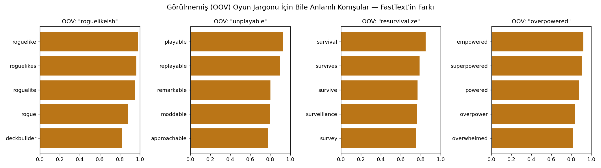
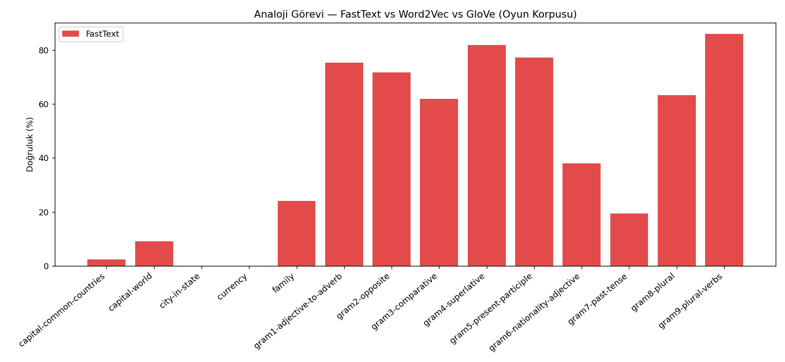
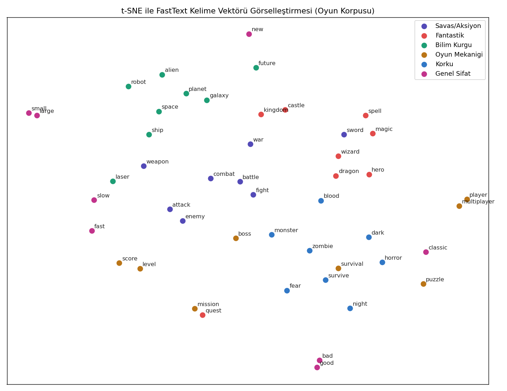
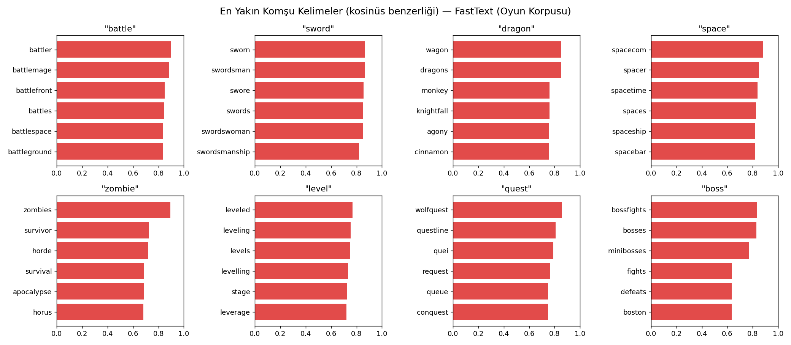

# FastText (Subword) — Oyun Versiyonu

## 🎓 Bu Proje Hakkında

Bu çalışmanın amacı, karakter n-gram (subword) tabanlı FastText yöntemini
eğitip, sözlük dışı (OOV) kelimeler için de vektör üretebilen bir model
kurmaktır.

**Kütüphane notu:** Facebook'un resmi `fasttext` C++/pybind11 paketi,
2023'ten beri güncellenmediği için Python 3.13 + güncel MSVC ile
derlenemiyor (pybind11 aşırı yükleme uyumsuzluğu). Bunun yerine, aynı
algoritmayı (skip-gram + karakter n-gram subword'leri + OOV desteği)
uygulayan, aktif geliştirilen `gensim.models.FastText` kullanıldı —
saf Python ile kurulabilir, derleme gerektirmez, ve script'in geri kalanı
(analoji değerlendirmesi, komşu arama, OOV demosu, görselleştirme) resmi
kütüphaneyle aynı arayüzü taklit eden ince bir sarmalayıcı sayesinde
değişmeden kaldı.

**Veri seti notu:** [`../word2vec`](../word2vec) ve [`../glove`](../glove)
projeleriyle aynı gerekçe — `fronkongames/steam-games-dataset`
katalogundaki "About the game" açıklamaları birleştirilerek oluşturulan
gerçek oyun-domaini metin korpusu kullanılıyor (üç proje ile **aynı**
korpus, adil üçlü kıyas için).

OOV (görülmemiş kelime) demosu, oyun endüstrisi jargonunda türetilen
kelimelerle (`roguelikeish`, `resurvivalize` vb.) FastText'in subword'lerden
anlamlı komşular bulabildiğini gösteriyor.

## 🚀 Çalıştırma

```bash
pip install -r requirements.txt
python fasttext_subword.py
```

İsteğe bağlı üçlü kıyas için `reference_word2vec_model.pt` ve
`reference_glove_model.pt` dosyalarını diğer iki projenin `data/`
klasöründen buraya kopyalayabilirsin.

## 📊 Sonuçlar (gerçek çalıştırma)

Eğitim süresi 91 saniye, vocab boyutu 15.828 kelime. Mikolov analoji
test setinde (1553 soru) toplam doğruluk **%56,2 (873/1553)** —
aynı korpus üzerinde eğitilen word2vec (%4,1) ve GloVe'dan (%4,1)
çarpıcı biçimde yüksek.

Kategori kırılımı bu farkın nedenini açıkça gösteriyor:

| Kategori | Doğruluk |
|---|---|
| gram9-plural-verbs | %86,0 |
| gram4-superlative | %82,0 |
| gram5-present-participle | %77,3 |
| gram1-adjective-to-adverb | %75,3 |
| gram2-opposite | %71,8 |
| gram8-plural | %63,3 |
| gram3-comparative | %62,0 |
| gram6-nationality-adjective | %38,0 |
| family | %24,0 |
| gram7-past-tense | %19,3 |
| capital-world | %9,1 |
| capital-common-countries | %2,4 |
| currency | %0,0 |

**Yorum:** Yüksek skor, morfolojik (gram*) kategorilerden geliyor —
subword (karakter n-gram) bilgisi, ek/çekim kalıplarını (çoğul, zaman,
sıfat→zarf, üstünlük) korpus küçük ve alan-dışı olsa bile yakalayabiliyor.
Buna karşılık dünya bilgisi gerektiren kategoriler (başkent, para birimi)
düşük kaldı çünkü oyun açıklamaları korpusu bu bilgiyi içermiyor. Bu,
FastText'in subword avantajının tam olarak nerede işe yaradığını gösteren
öğretici bir sonuç.

| | |
|---|---|
|  |  |
|  |  |

## 🛠️ Kullanılan Teknolojiler

`Python` · `gensim` (FastText) · `PyTorch` · `scikit-learn` (t-SNE) · `kagglehub`

<p align="center"><i>Öğrenme sürecinde egzersiz olarak hazırlanmış bir versiyondur.</i></p>
