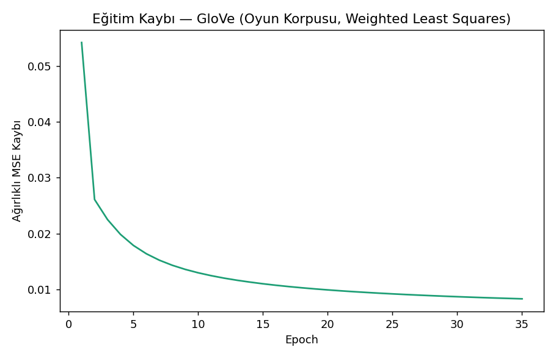
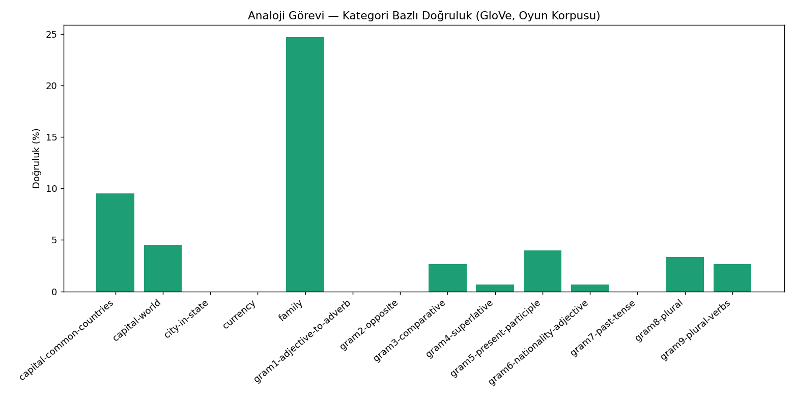
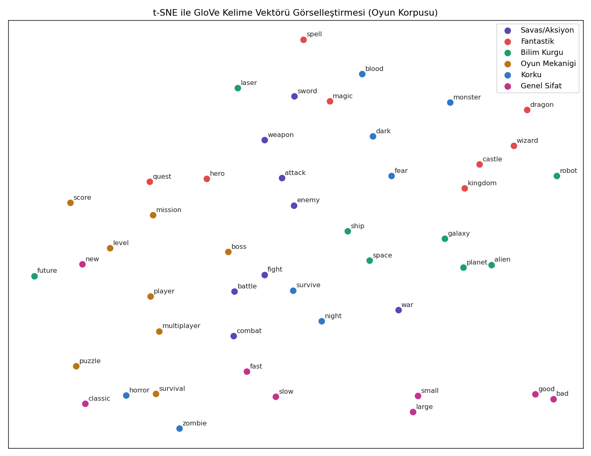
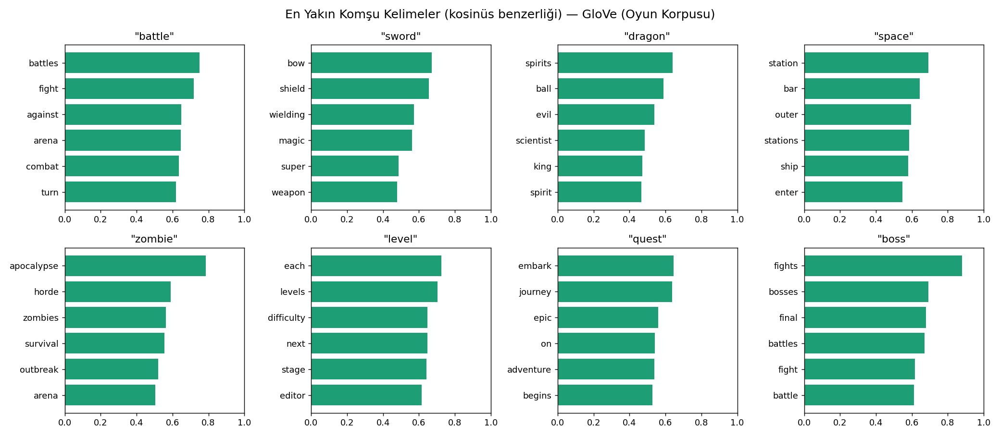

# GloVe (Global Vectors) — Oyun Versiyonu

## 🎓 Bu Proje Hakkında

Bu çalışmanın amacı, count-based matrix factorization'a dayanan GloVe
(Global Vectors) yöntemini sıfırdan kurup bir metin korpusu üzerinde
eğitmektir.

**Veri seti notu:** [`../word2vec`](../word2vec) projesiyle aynı gerekçe —
`fronkongames/steam-games-dataset` katalogundaki "About the game"
açıklamaları birleştirilerek oluşturulan gerçek oyun-domaini metin korpusu
kullanılıyor (adil kıyas için word2vec projesiyle **aynı** korpus).

**İsteğe bağlı kıyaslama:** `../word2vec/data/word2vec_model.pt` dosyasını
bu klasöre `reference_word2vec_model.pt` olarak kopyalarsan, script
GloVe'u aynı korpusla eğitilmiş Word2Vec ile karşılaştırır (count-based
vs prediction-based yaklaşım kıyası).

## 🚀 Çalıştırma

```bash
pip install -r requirements.txt
python glove_scratch.py
```

## 📊 Sonuçlar (gerçek çalıştırma — word2vec ile aynı korpus, 15.828 kelime vocab)

**GloVe analoji doğruluğu: %4.1** (63/1553) — word2vec ile **aynı skor**,
farklı iki yaklaşımın (count-based matrix factorization vs
prediction-based skip-gram) bu küçük domain-özel korpusta benzer sonuç
verdiğini gösteriyor. Eğitim kaybı 35 epoch'ta 0.0542'den 0.0083'e
düzenli şekilde azaldı.

| | |
|---|---|
|  |  |
|  |  |

## 🛠️ Kullanılan Teknolojiler

`Python` · `PyTorch` · `scipy` (sparse co-occurrence matrisi) · `scikit-learn` (t-SNE) · `kagglehub`

<p align="center"><i>Öğrenme sürecinde egzersiz olarak hazırlanmış bir versiyondur.</i></p>
