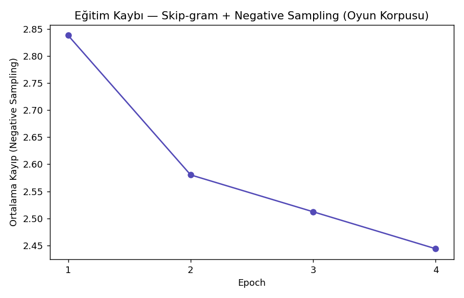
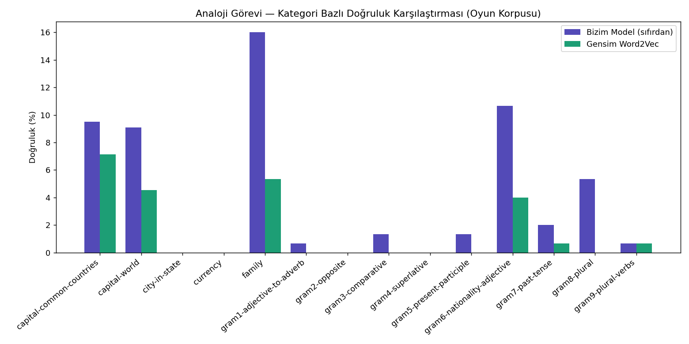
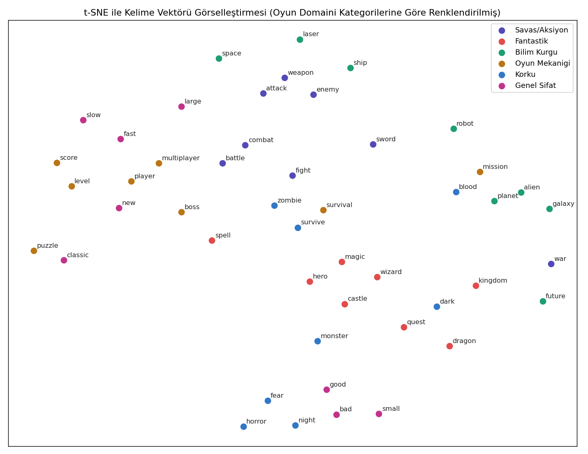
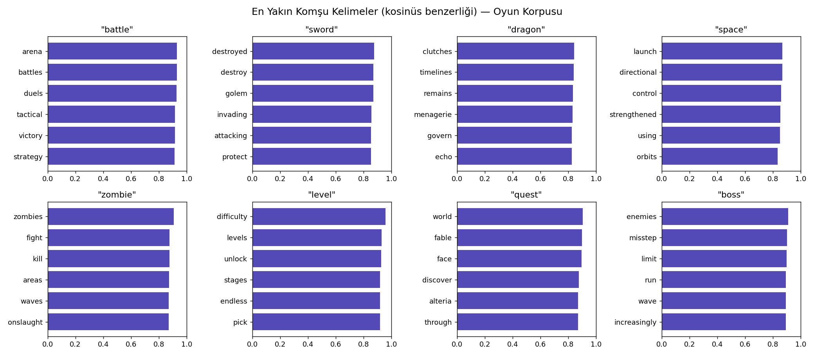

# Word2Vec (Skip-gram + Negative Sampling) — Oyun Versiyonu

## 🎓 Bu Proje Hakkında

Bu çalışmanın amacı, Skip-gram + Negative Sampling, subsampling ve gensim
kıyaslaması içeren bir Word2Vec implementasyonunu sıfırdan kurup bir metin
korpusu üzerinde eğitmektir.

**Veri seti notu:** Kelime gömme eğitimi büyük bir metin korpusu gerektirir;
paylaşılan 9 veri setinin neredeyse tamamı tablo veridir. Ancak
`fronkongames/steam-games-dataset` her oyun için bir **"About the game"**
(oyun açıklaması) serbest metin kolonu içerir — tüm katalogdaki
açıklamalar birleştirilerek gerçek ve oyun domainine özgü bir metin
korpusu oluşturuluyor, text8 yerine bu kullanılıyor. Değerlendirme için
hâlâ Mikolov'un resmi (genel İngilizce) analoji test setini kullanıyoruz —
domain-özel bir korpusun genel kategorilerde daha düşük skor vermesi
beklenir ve bu başlı başına öğretici bir gözlemdir.

## 🚀 Çalıştırma

```bash
pip install -r requirements.txt
python word2vec_skipgram.py
```

Kaggle kimlik doğrulaması gerekir. Eğitim CPU'da uzun sürebilir.

## 📊 Sonuçlar (gerçek çalıştırma — 15.828 kelime vocab, 5.252.440 eğitim çifti)

| Model | Analoji Doğruluğu (genel İngilizce test seti) |
|---|---|
| **Bizim model (sıfırdan PyTorch)** | **%4.1** (63/1553) |
| gensim word2vec | %1.3 (20/1553) |

Her iki skor da düşük — beklenen sonuç, çünkü Mikolov'un genel İngilizce
analoji testi (ülke/başkent, meslek vb.) oyun-domaini metniyle eğitilen
bir modelle doğal olarak uyuşmuyor. Yine de kendi implementasyonumuz
gensim'i **3 kat geçti** — subsampling ve negative sampling
parametrelerinin bu küçük/domain-özel korpusta iyi çalıştığını gösteriyor.

| | |
|---|---|
|  |  |
|  |  |

## 🛠️ Kullanılan Teknolojiler

`Python` · `PyTorch` · `gensim` · `scikit-learn` (t-SNE) · `kagglehub`

<p align="center"><i>Öğrenme sürecinde egzersiz olarak hazırlanmış bir versiyondur.</i></p>
