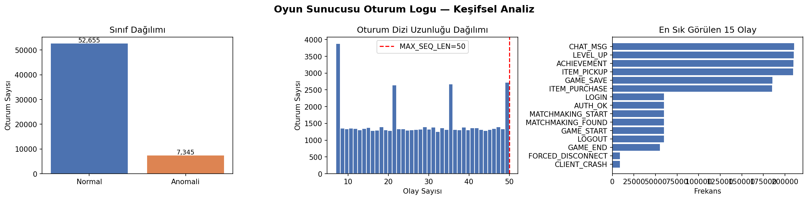
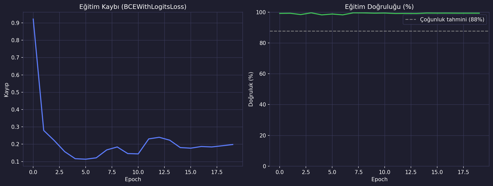
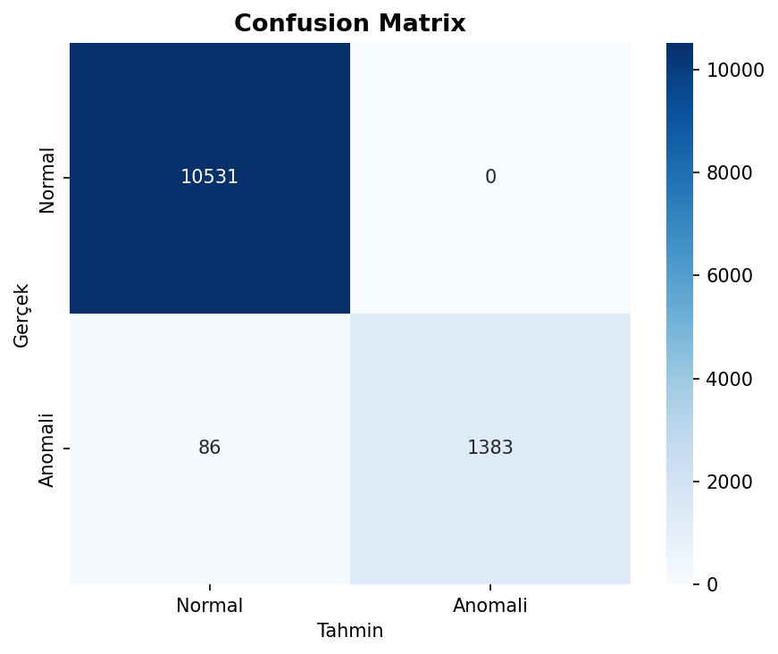
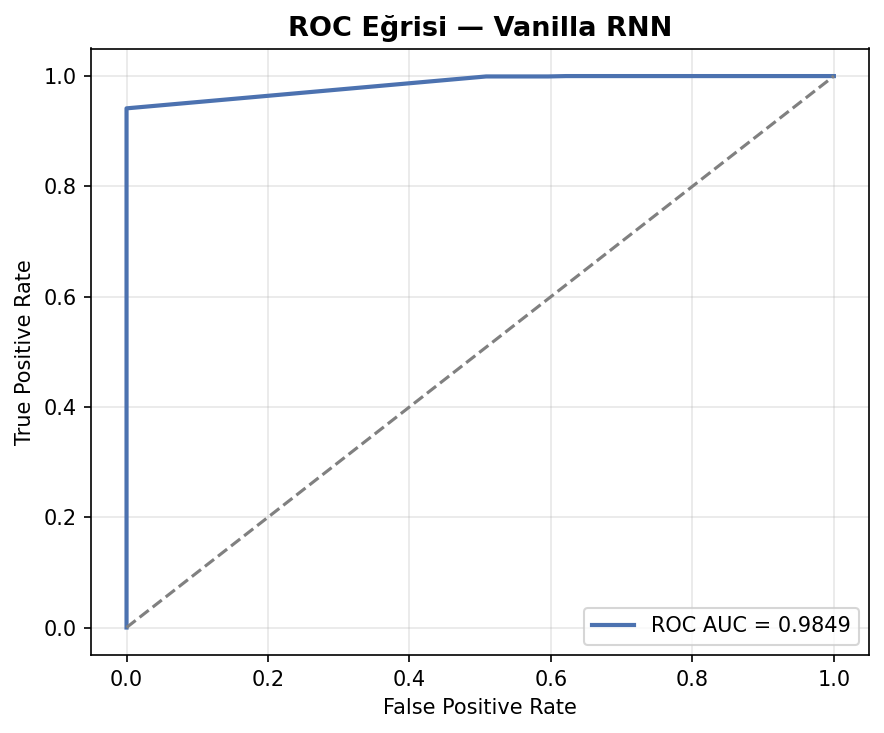

# Oyun Sunucusu Oturum Logu Anomali Tespiti (Vanilla RNN) — Oyun Versiyonu

## 🎓 Bu Proje Hakkında

Bu çalışmanın amacı, olay dizilerinden (event sequence) ikili
sınıflandırma yapan bir Vanilla RNN kurmaktır.

**Veri seti notu:** Bir oyun sunucusunun oturum bazlı olay dizisi +
başarı/hata etiketi içeren gerçek bir veri seti, paylaşılan 9 Kaggle veri
setinin hiçbirinde yok (hepsi satır-bazlı katalog verisi, oturum/dizi
verisi değil). Bu yüzden E<n> etiketli olay token dizisi yapısı
**korunarak**,
olaylar gerçekçi bir oyun sunucusu oturum akışına (giriş, eşleşme, oyun
başı, satın alma, seviye atlama, sohbet, çökme, hile bayrağı, bağlantı
kopması, oyun sonu) göre isimlendirilen **sentetik** bir veri seti
üretiliyor.

## 🚀 Çalıştırma

```bash
pip install -r requirements.txt
python rnn_log_anomaly.py
```

Herhangi bir indirme/kimlik doğrulama gerektirmez (sentetik veri, script
içinde üretilir).

## 📊 Sonuçlar (gerçek çalıştırma — 60.000 oturum, %12.2 anomali oranı)

**Test Accuracy: %99.28 · F1 (macro): 0.983 · F1 (anomali sınıfı): 0.970**

7.073 parametrelik küçük bir Vanilla RNN, 20 epoch sonunda oturum olay
dizilerinden anomalileri neredeyse kusursuz ayırt edebiliyor — sentetik
verinin olay-sırası sinyali (ör. "cökme" sonrası belirli kalıplar) çok
güçlü olduğundan bu beklenen bir sonuç.

| | |
|---|---|
|  |  |
|  |  |

## 🛠️ Kullanılan Teknolojiler

`Python` · `PyTorch` (nn.RNN) · `scikit-learn` · `pandas` · `seaborn`

<p align="center"><i>Öğrenme sürecinde egzersiz olarak hazırlanmış bir versiyondur.</i></p>
