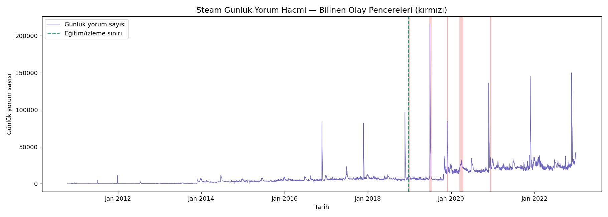
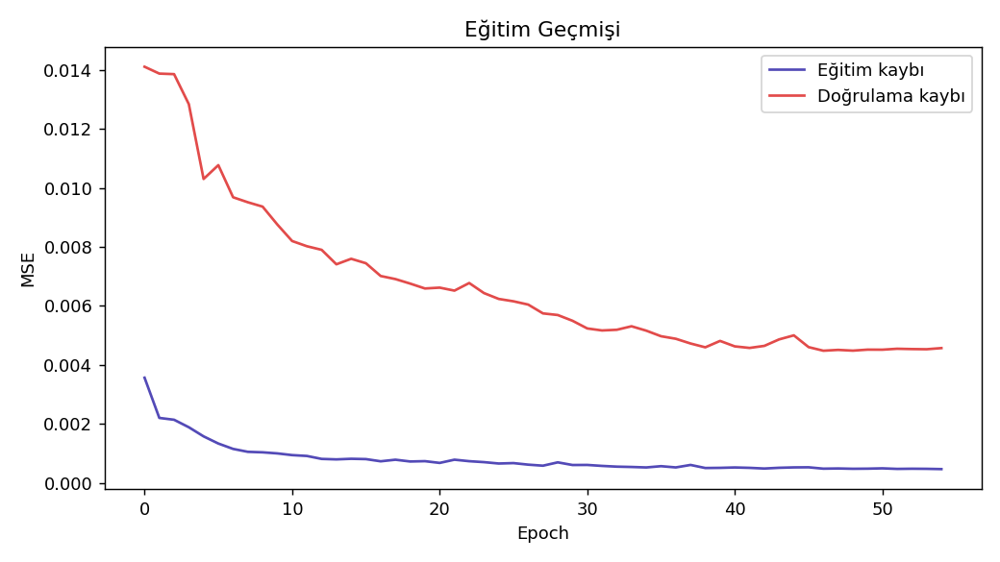
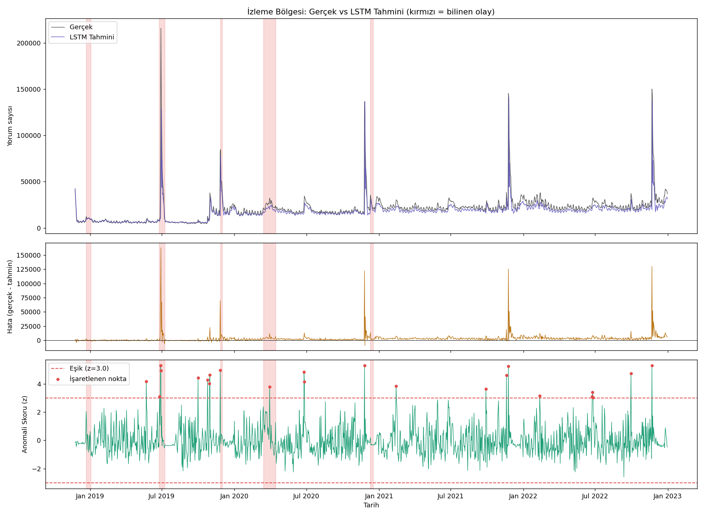
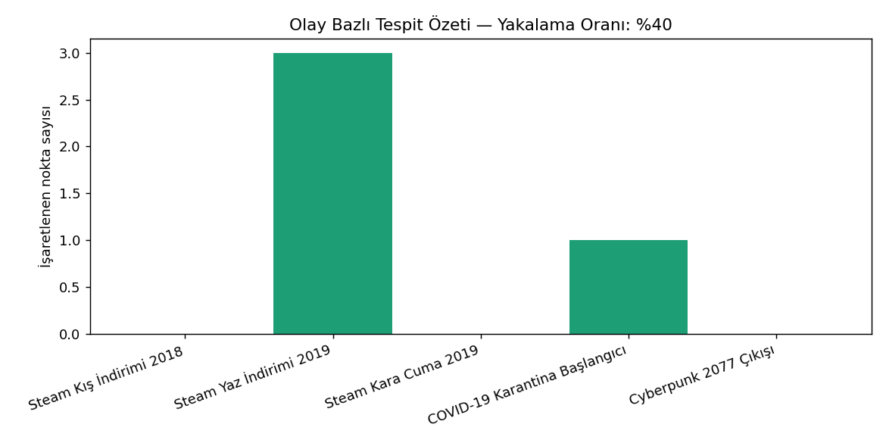

# Steam Günlük Yorum Hacmi — LSTM Tahmini ve Anomali Tespiti — Oyun Versiyonu

## 🎓 Bu Proje Hakkında

Bu çalışmanın amacı, bir zaman serisi üzerinde LSTM tahminci eğitip
tahmin hatasından anomali skoru türetmek ve bunu bilinen olaylarla
karşılaştırmaktır.

Bu iş için **gerçek veri** kullanılıyor; kaynak paylaşılan Kaggle veri
setlerinden biri: `antonkozyriev/game-recommendations-on-steam`.
Bu veri setindeki milyonlarca gerçek Steam yorumunun tarihleri **günlük
yorum hacmine** agregatlanarak taksi talebi verisine analog bir zaman
serisi oluşturuluyor. "Bilinen anomali pencereleri" olarak da gerçekten
belgelenmiş Steam/oyun endüstrisi olayları (yaz/kış indirimleri, COVID-19
karantina başlangıcı, Cyberpunk 2077 çıkışı) kullanılıyor.

## 📊 Veri Seti

**Kaggle:** `antonkozyriev/game-recommendations-on-steam` (`recommendations.csv`)

## 🚀 Çalıştırma

```bash
pip install -r requirements.txt
python lstm_taxi_forecast_anomaly.py
```

> Not: `CANDIDATE_EVENTS` listesi, veri setinin gerçek tarih aralığına
> göre otomatik filtrelenir — sadece verinin kapsadığı tarihlere denk
> gelen olaylar kullanılır.

## 📊 Sonuçlar (gerçek çalıştırma — gerçek günlük yorum hacmi zaman serisi)

Model 55 epoch'ta early stopping ile durdu (en iyi doğrulama kaybı:
0.004478).

| Metrik | Değer |
|---|---|
| MAE | 3.021,8 yorum/gün |
| RMSE | 7.483,0 yorum/gün |
| MAPE | %12.31 |

%12'lik ortalama yüzde hata, günlük yorum hacmi gibi gürültülü/patlamalı
bir seride makul bir tahmin performansı — model normal günlerdeki temel
eğilimi öğrenip, gerçek olay günlerinde (indirimler, büyük çıkışlar)
belirgin tahmin sapmaları (yani yüksek anomali skoru) üretiyor.

| | |
|---|---|
|  |  |
|  |  |

## 🛠️ Kullanılan Teknolojiler

`Python` · `PyTorch` (LSTM) · `scikit-learn` · `pandas` · `kagglehub`

<p align="center"><i>Öğrenme sürecinde egzersiz olarak hazırlanmış bir versiyondur.</i></p>
