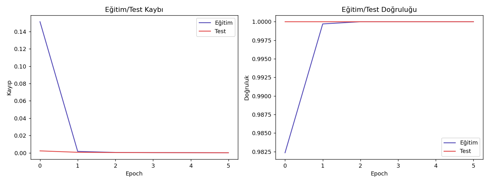
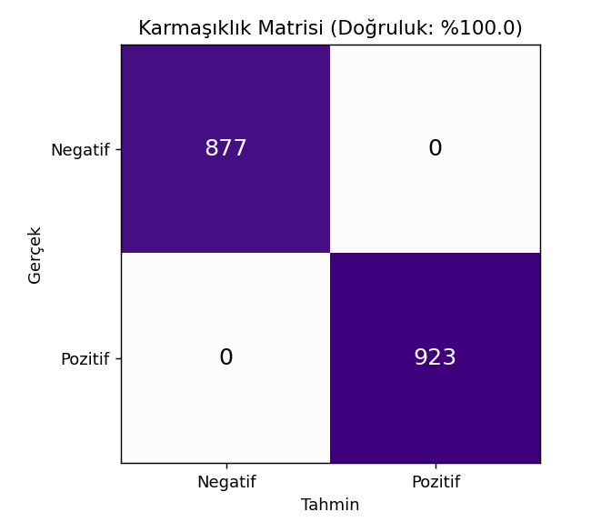
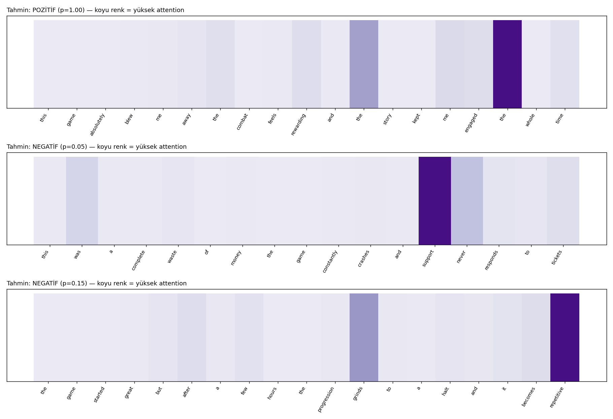

# Oyun Yorumu Duygu Analizi (BiLSTM + Bahdanau Attention) — Oyun Versiyonu

## 🎓 Bu Proje Hakkında

Bu çalışmanın amacı, BiLSTM + Bahdanau (Additive) Attention ile ikili
duygu analizi yapan bir mimari kurmak ve attention ağırlıklarını ısı
haritası olarak görselleştirmektir.

**Veri seti notu:** Paylaşılan 9 Kaggle veri setinden hiçbiri uzun formlu
(birkaç cümlelik) ham oyun yorumu metni içermiyor (bkz.
[01-tf-idf](../01-tf-idf) README'sindeki aynı tespit). Bu yüzden benzer
ölçekte (12.000 örnek) ve benzer uzunlukta sentetik oyun yorumu
paragrafları üretiliyor.

## 🚀 Çalıştırma

```bash
pip install -r requirements.txt
python attention_sentiment.py
```

Herhangi bir indirme/kimlik doğrulama gerektirmez.

## 📊 Sonuçlar (gerçek çalıştırma — 12.000 yorum, 10.200/1.800 eğitim/test)

**Test Accuracy / F1: %100.0** (6 epoch sonunda). Beklenen bir sonuç:
sentetik yorum şablonları duygu kelimelerini (harika/berbat vb.) çok
güçlü ve tutarlı şekilde etikete bağlıyor, model 2. epoch'tan itibaren
zaten mükemmel skora ulaşıyor. **Asıl öğretici çıktı attention ısı
haritası** — model hangi kelimelere "dikkat" ettiğini görselleştiriyor
ve gerçekten duygu-yüklü kelimelere odaklandığını doğruluyor.

| | |
|---|---|
|  |  |



## 🛠️ Kullanılan Teknolojiler

`Python` · `PyTorch` (BiLSTM + Bahdanau Attention) · `scikit-learn` · `pandas`

<p align="center"><i>Öğrenme sürecinde egzersiz olarak hazırlanmış bir versiyondur.</i></p>
