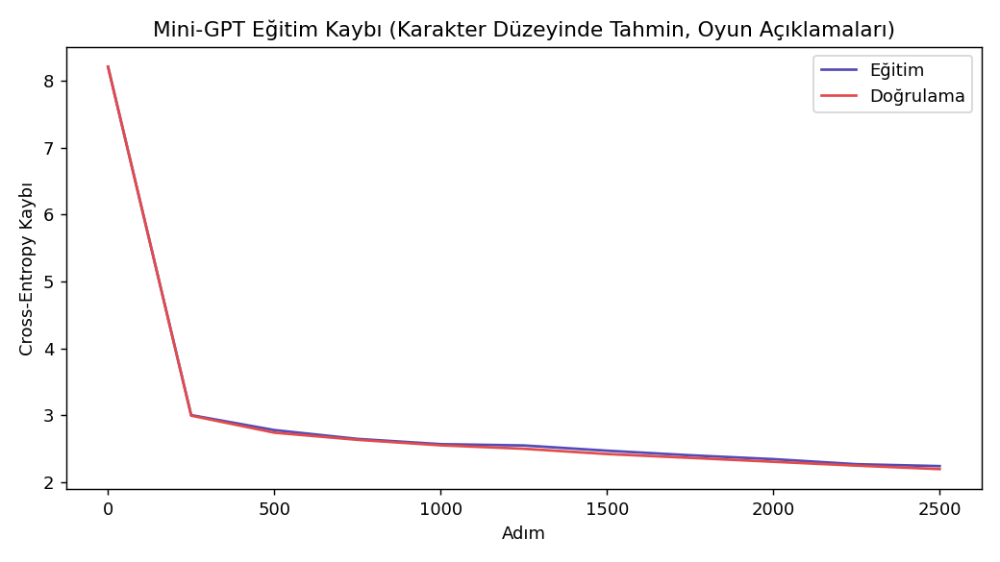
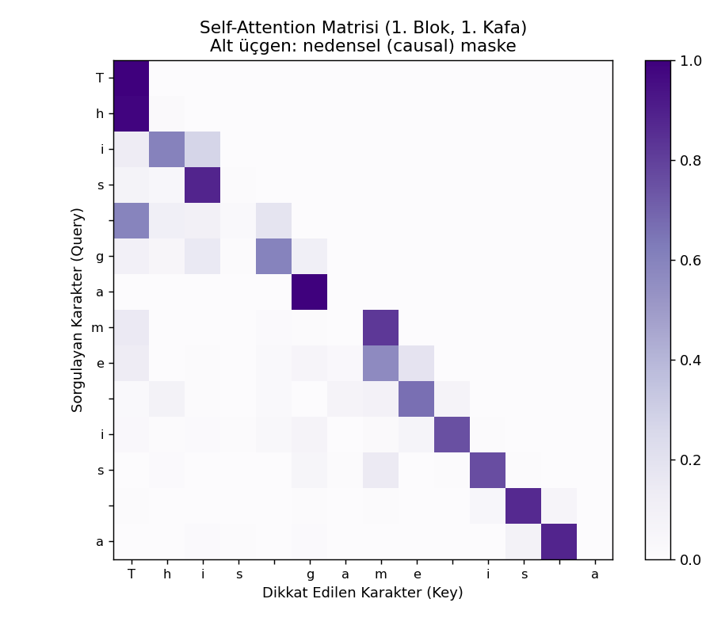

# Karakter Düzeyinde Mini-GPT (Decoder-only Transformer) — Oyun Versiyonu

## 🎓 Bu Proje Hakkında

Bu çalışmanın amacı, karakter düzeyinde decoder-only bir Transformer/
mini-GPT mimarisini (multi-head self-attention, positional embedding,
causal mask, residual, layer norm) sıfırdan kurup bir oyun metni korpusu
üzerinde eğitmektir.

**Veri seti notu:** [word-embeddings](../02-word-embeddings) projeleriyle
aynı gerekçe — `fronkongames/steam-games-dataset` katalogundaki "About the
game" açıklamaları, Tiny Shakespeare'in yerini alan karakter-düzeyinde
eğitim korpusu olarak kullanılıyor. **Önemli fark:** word2vec/glove/
fasttext projelerindeki korpus kelime-düzeyinde olduğu için agresif
temizlenip (küçük harf, noktalama yok) tek kelimelere ayrılmıştı; bu
projede karakter düzeyinde öğrenim yapıldığından büyük/küçük harf ve
noktalama **bilerek korunuyor** — aksi halde modelin öğreneceği karakter
kümesi anlamsızlaşırdı.

Eğitilen model, Shakespeare yerine **"AI tarafından yazılmış Steam oyun
tanıtım metni"** üretir.

## 📊 Veri Seti

**Kaggle:** `fronkongames/steam-games-dataset`

## 🚀 Çalıştırma

```bash
pip install -r requirements.txt
python minigpt_transformer.py
```

## 📊 Sonuçlar (gerçek çalıştırma — 4M karakter, 3.069 benzersiz karakter, 549.501 parametre)

Eğitim kaybı 2500 adımda **8.21 → 2.24**'e düştü (doğrulama kaybı 2.20,
overfitting yok — eğitim/doğrulama kaybı birbirine yakın seyrediyor).

**Üretilen örnek metin** (2500 adım sonrası, hâlâ kelime düzeyinde tutarlı
değil ama İngilizce kelime/heceleme kalıplarını öğrenmiş):

> *"Nofte onearfit your ewntegg the whare the une timmple fect..."*

Bu, karakter-seviyeli küçük bir modelin (549K parametre, GPT-2'nin
~1/300'ü büyüklüğünde) bu kadar kısa eğitimle beklenen bir sonucu —
gerçek kelimeler yerine kelime-benzeri diziler üretiyor. Daha uzun eğitim
veya daha büyük model, daha tutarlı çıktı üretir.

| | |
|---|---|
|  |  |

## 🛠️ Kullanılan Teknolojiler

`Python` · `PyTorch` (sıfırdan decoder-only Transformer) · `kagglehub`

<p align="center"><i>Öğrenme sürecinde egzersiz olarak hazırlanmış bir versiyondur.</i></p>
